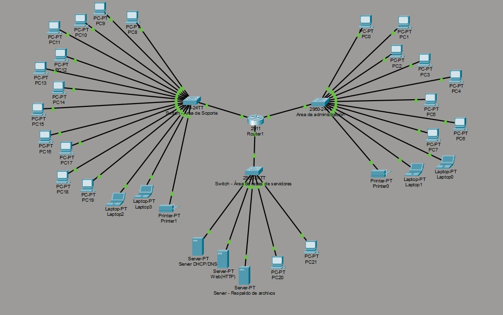

1.  **Diseño de arquitectura de red**

**Cálculo Manual de Subredes**

Nuestra red base es 172.28.15.0 /24. Esto significa que tenemos el
último octeto libre (8 bits) para jugar.

1\. **Subred Soporte Técnico (16 hosts necesarios)**

Fórmula: Necesitamos 2\^n - 2 \>= 15(12 PCs + 2 Laps + 1 Impresora).
Pero ojo, sumando el Gateway son 16.

Búsqueda en tu tabla:

Si usamos 2\^4 = 16. Restamos 2 (red y broadcast) y nos quedan 14. No
nos alcanza (necesitamos 16).

Si usamos 2\^5 = 32. Restamos 2 y nos quedan 30 IPs útiles. Esta es la
elegida.

Cálculo de Máscara: Como usamos 5 bits para hosts, nos quedan 32 - 5 =
27 bits para red. Máscara: /27.

En decimal: 256 - 32 = 255.255.255.224.

Rango: Empieza en .0. El broadcast es el anterior al siguiente salto
(0 + 32 - 1 =31).

**2. Subred Administración (12 hosts necesarios)**

Fórmula: Necesitamos 2\^n - 2 \>= 11 (8 PCs + 2 Laps + 1 Impresora).
Sumando Gateway = 12.

Búsqueda en tu tabla:

2\^3 = 8(Muy poco).

2\^4 = 16. Restamos 2 y nos quedan 14 IPs útiles. Esta nos alcanza
perfecto.

Cálculo de Máscara: Usamos 4 bits para hosts. 32 - 4 = 28. Máscara: /28.

En decimal: 256 - 16 = 255.255.255.240.

Rango: Empezamos justo después del broadcast anterior (.31), es decir,
en .32. El salto es de 16. El broadcast es 32 + 16 - 1 = 47.

**3. Subred Servidores (6 hosts necesarios)**

Fórmula: Necesitamos 2\^n - 2 \>= 5 (3 Servidores + 2 PCs). Sumando
Gateway = 6.

Búsqueda en tu tabla:

2\^3 = 8. Restamos 2 y nos quedan 6 IPs útiles. Justo lo que
necesitamos.

Cálculo de Máscara: Usamos 3 bits para hosts. 32 - 3 = 29. Máscara: /29.

En decimal: 256 - 8 = 255.255.255.248.

Rango: Empezamos después del .47, es decir, en .48. El salto es de 8. El
broadcast es 48 + 8 - 1 = 55.

- **Área 1: Soporte Técnico (La más grande)**

Requerimiento: 12 PCs + 2 Laptops + 1 Impresora + 1 Gateway = 16 hosts
necesarios.

Dirección IP de subred: Como es la primera, empezamos en el punto cero:
172.28.15.0.

Máscara de subred: Para cubrir 16 hosts, necesitamos 2\^5 = 32
direcciones (porque 2\^4 = 16 pero al restar Red y Broadcast nos
quedarían solo 14 libres).

Prefijo: /27.

Decimal: 255.255.255.224.

Cantidad de hosts válidos: 32 - 2 = 30.

Gateway (Puerta de enlace): Es la primera IP utilizable: 172.28.15.1.

Dirección IP del primer host: 172.28.15.2 (ya que la .1 la tiene el
router).

Dirección IP del último host: Calculamos el broadcast primero. Si el
salto es de 32, la siguiente red empieza en .32, así que el último host
es 172.28.15.30.

Dirección de Broadcast: 172.28.15.31.

- **Área 2: Administración**

Requerimiento: 8 PCs + 2 Laptops + 1 Impresora + 1 Gateway = 12 hosts
necesarios.

Dirección IP de subred: Empezamos justo donde terminó la anterior:
172.28.15.32.

Máscara de subred: Para 12 hosts, nos sirve 2\^4 = 16 direcciones (16 -
2 = 14 útiles).

Prefijo: /28.

Decimal: 255.255.255.240.

Cantidad de hosts válidos: 16 - 2 = 14.

Gateway: Primera IP utilizable: 172.28.15.33.

Dirección IP del primer host: 172.28.15.34.

Dirección IP del último host: El salto es de 16 (32 + 16 = 48). El
último host es 172.28.15.46.

Dirección de Broadcast: 172.28.15.47.

- **Área 3: Servidores**

Requerimiento: 3 Servidores + 2 PCs Admin + 1 Gateway = 6 hosts
necesarios.

Dirección IP de subred: Empezamos después del broadcast anterior:
172.28.15.48.

Máscara de subred: Para 6 hosts, usamos 2\^3 = 8 direcciones (8 - 2 = 6
útiles). Queda exacto.

Prefijo: /29.

Decimal: 255.255.255.248.

Cantidad de hosts válidos: 8 - 2 = 6.

Gateway: Primera utilizable: 172.28.15.49.

Dirección IP del primer host: 172.28.15.50.

Dirección IP del último host: El salto es de 8 (48 + 8 = 56). El último
host es 172.28.15.54.

Dirección de Broadcast: 172.28.15.55.

| **Área** | **Prefijo** | **Máscara** | **IPs Totales** |  | **IPs Útiles** | **Red** | **Primera Útil (Gateway)** | **Última Útil** | **Broadcast** |
|:--:|:--:|:--:|:--:|:--:|:--:|:--:|:--:|:--:|:--:|
| **Soporte Técnico** | /27 | 255.255.255.224 | 32 |  | 30 | 172.28.15.0 | 172.28.15.1 | 172.28.15.30 | 172.28.15.31 |
| **Administración** | /28 | 255.255.255.240 | 16 |  | 14 | 172.28.15.32 | 172.28.15.33 | 172.28.15.46 | 172.28.15.47 |
| **Servidores** | /29 | 255.255.255.248 | 8 |  | 6 | 172.28.15.48 | 172.28.15.49 | 172.28.15.54 | 172.28.15.55 |

**2. Justificación técnica de la propuesta de segmentación**

La segmentación se realizó mediante la técnica VLSM (Variable Length
Subnet Mask). La justificación técnica se basa en:

Aprovechamiento del espacio de direccionamiento: Al asignar máscaras
específicas para cada necesidad (/27, /28, /29), evitamos el desperdicio
de IPs que ocurriría con un subneteo tradicional de máscara fija.

Seguridad por aislamiento: Al separar el área técnica, la administrativa
y los servidores, limitamos el radio de impacto ante posibles ataques o
errores de red, permitiendo aplicar políticas de seguridad diferenciadas
por subred.

**3. Topología en Packet Tracer**

- **Centro:** 1 Router 2911 (centralizando las 3 subredes).

- **Distribución:** 3 Switches 2960 (uno por cada área).

- **Extremos:** Conexión de los terminales (PCs, Laptops, Impresoras y
  Servidores) a sus respectivos switches.

\"Diseñamos una topología física donde un Router central actúa como la
puerta de enlace (Gateway) para tres Switches de acceso, los cuales
distribuyen la señal a los dispositivos finales de cada área,
manteniendo la separación lógica que calculamos en el Excel\".

**4. Justificación del tipo de arquitectura**

Es una arquitectura de Red de Área Local (LAN) segmentada con topología
física en Estrella.

Justificación: Se considera en estrella porque todos los nodos (PCs,
laptops, impresoras) convergen en un punto central (el Switch de su
área) y estos a su vez convergen en el Router. La segmentación lógica
(VLSM) nos permite que, aunque estén físicamente cerca, funcionen como
redes independientes.

**5. Función de la máscara de subred**

La máscara de subred es un código binario de 32 bits que sirve para
delimitar y diferenciar qué parte de una dirección IP corresponde a la
red y qué parte corresponde al host. Es lo que permite a los
dispositivos saber si un paquete debe entregarse localmente o ser
enviado al Gateway para salir de la subred.

**6. ¿Por qué la división propuesta permite una mejor organización?**

Porque permite una gestión administrativa independiente. Por ejemplo:

Se pueden aplicar reglas de calidad de servicio (QoS) prioritarias para
el área administrativa.

Facilita la resolución de problemas (troubleshooting), ya que si hay una
falla en el segmento de \"Soporte Técnico\", las demás áreas siguen
operando con normalidad.

Permite un crecimiento ordenado: si el área de Servidores crece, su
subred está claramente delimitada sin afectar el direccionamiento de las
otras áreas.
