# Configuracion base en Packet Tracer

## Paso 1: Conectar correctamente los dispositivos


Primeramente para cada subred, administración, soporte técnico y servidores, conectamos cada dispositivo a un switch correspondiente a cada subred. Para esto en la parte inferior de Packet Tracer, seleccionamos "Connections" como se ve en la imagen,

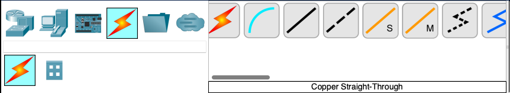

Seleccionamos el cable adecuado para conexión entre cada dispositivo y el switch, la cual se realiza a traves de los puertos FastEthernet, por lo que el cable recomendado es el "Copper Straight-Through", y conectamos cada dispositivo a un puerto del switch, como se muestra en la imagen.

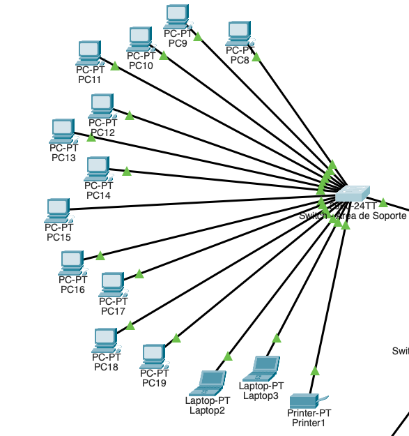

Seleccionando el puerto FastEthernet0 del dispositivo correspondiente, y uno de los puertos FastEthernet del switch, como se muestra en las siguientes imágenes:

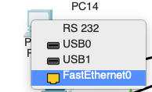
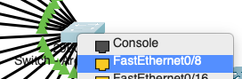

Una vez realizada esta conexión, podemos observar como el enlace entre el dispositivo y el switch se encuentra en un estado temporalmente bloqueado mientra el switch determina at raves del Spanning Tree Protocol que no existe un bucle en la red debido a la conexión con otro switch. 

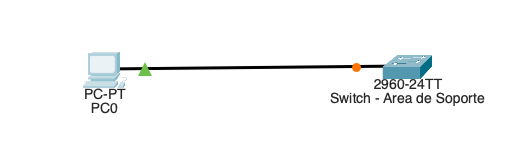

Una vez que el switch determina que no existe un bucle, el enlace se encuentra en estado de "up" (triangulo verde), lo que indica que la conexión entre el dispositivo y el switch es exitosa.

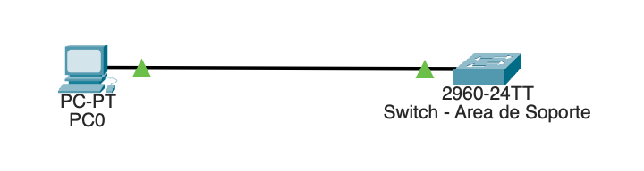

Procedemos a conectar cada dispositivo a su respectivo switch, para las demas subredes:

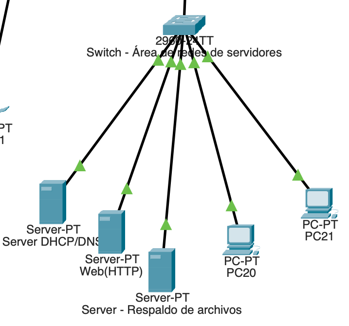
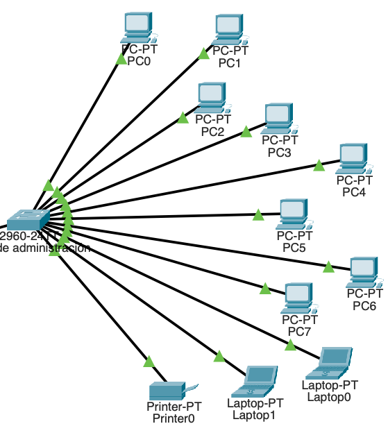

## Paso 2: Conexion switches - router

Para realizar la conexion entre cada switch y el router, se usamos nuevamente el cable "Copper Straight-Through" debido a la conexion entre puertos GigabitEthernet de estos dispositivos (img 9 y 10).

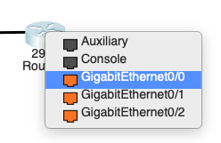
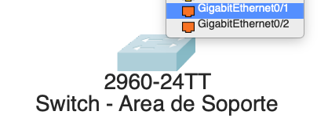

Observamos que la conexión se encuentra en estado "down" (triangulo rojo - imagen 11),  debido a que las interfaces del router se encuentran apagadas por defecto por que el necesario habilitarlas, para esto usamos el CLI del router(img 12).

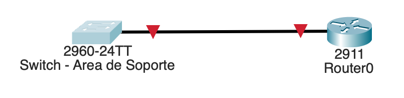
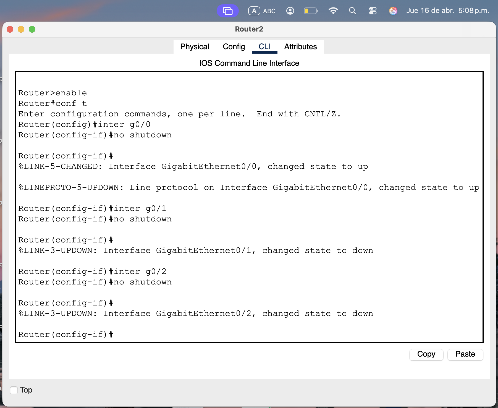

Observamos en la img 12 los siguientes comandos:

```console
Router> enable #para ingresar al modo privilegiado del router
Router# conf t #(configure terminal) para ingresar al modo de configuración global del router
Router(config)# inter g0/0 #(interface gigabitethernet 0/0) para ingresar a la configuración de la interfaz g0/0 del router
Router(config-if)# no shutdown #(para habilitar la interfaz g0/0 del router)
```

Una vez habilitada la interfaz g0/0 del router, observamos que el router esta en estado "up" y el router entra en estado de verificar la ausencia de loops antes de pasar a estado "up" (img 13-14).

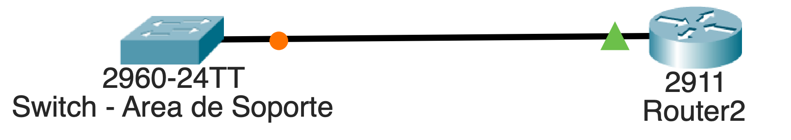
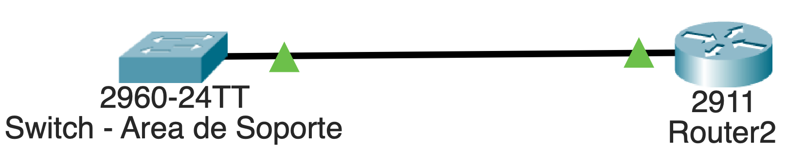

Asi usamos la instruccion ```no shutdown``` para las otras interfaces del router, g0/1 y g0/2, para establecer la conexion entre cada switch y el router (img 15).

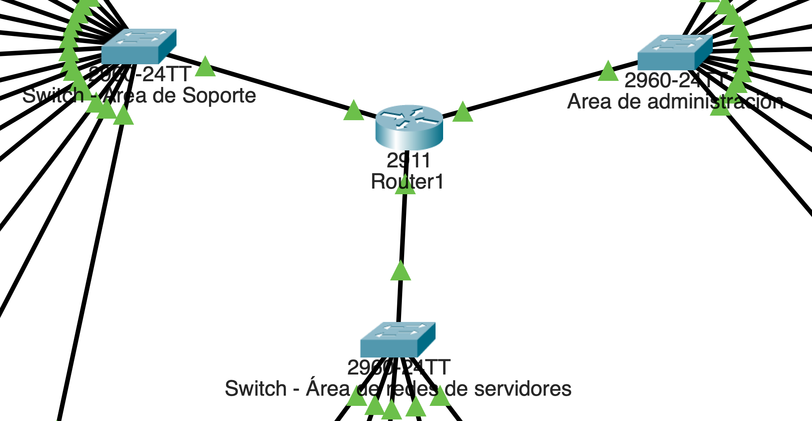
## Paso 3: Asignar direcciones estáticas IPv4 a:
Partiendo del subnetting realizado en la fase 1 y el archivo Fase1/subnetting.xlsx anexo a este documento realizamos la asignación de direcciones IP estáticas.

### Asignación IPs al router

Para la asignación de direcciones IP al router, se asignan las primeras IPs útiles las cuales corresponden al gateway de cada subred, estas gateway se configuran en las interfaces del router, segun las reglas que definimos en la fase 1, comenzando por la menor ip útil a la subred con mas hosts, y asi sucesivamente, quedando de la siguiente manera:

- **Soporte Técnico**:
  - Interfaz g0/0 del router:
    - Dirección IP: 172.28.15.1
    - Máscara de subred: 255.255.255.224
- **Administración**:
    - Interfaz g0/1 del router:
        - Dirección IP: 172.28.15.33
        - Máscara de subred: 255.255.255.240
- **Servidores**:
    - Interfaz g0/2 del router:
        - Dirección IP: 172.28.15.49
        - Máscara de subred: 255.255.255.248

Que puede ser configurado en el CLI del router como se ve en la siguiente imagen:

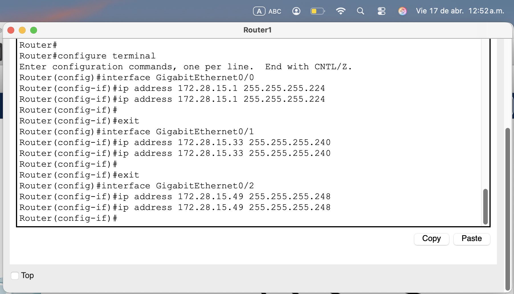

notamos en la imagen 16 que la configuración de la dirección IP se realiza dentro de la configuración de la interfaz del router, y se usa el comando ```ip address``` para asignar la dirección IP y la mascara de subred a cada interfaz del router.

### Asignación IPs a los servidores

Como podemos observar en el archivo Fase1/subnetting.xlsx, para la subred de servidores las direcciones IP útiles van desde comparten la mascara de subred /29, lo cual nos da un rango de 6 hosts útiles, por lo que asignamos las IPs a cada servidor comenzando por la cuarta IP útil, quedando de la siguiente manera:

- Servidor DHCP/DNS:
    - Dirección IP: 172.28.15.52
- Servidor Web:
    - Dirección IP: 172.28.15.53
- Servidor de respaldo de archivos:
    - Dirección IP: 172.28.15.54

Con mascara de subred 255.255.255.248. Esta configuración se puede realizar desde el menu de configuración de cada servidor, seleccionando la opción "Config", luego "FastEthernet0" y seleccionando la opción "Static" para asignar una dirección IP estática, como se muestra en la siguiente imagenes 17-19.

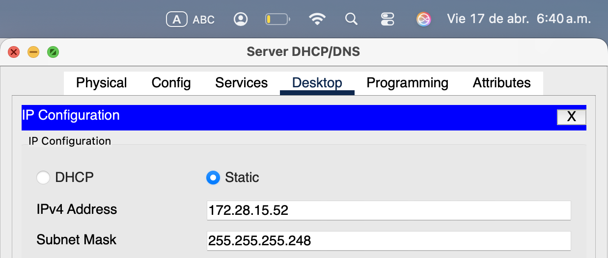
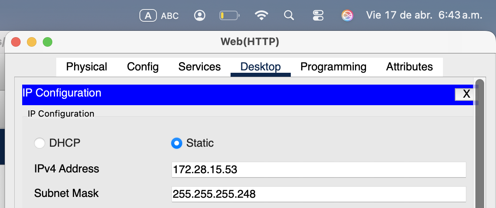
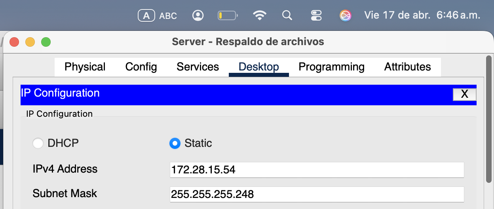

**Nota**: la configuración de estas IPs se puede realizar en la aplicación **IP configuration** que aparece en el desktop de cada servidor.

### Asignación IPs a impresoras

La red cuenta con 2 impresora, una hace parte de la red de Area de Soporte con dirección IP de red 172.28.15.0/27, y la otra hace parte de la red de Area de Administración con dirección IP de red 172.128.15.32/28, por lo que asignamos la IP estática mas cercana a la ultima IP útil de cada subred, quedando de la siguiente manera:

- Impresora Soporte Técnico:
    - Dirección IP: 172.28.15.16/27
- Impresora Administración:
    - Dirección IP: 172.28.15.34/28

Esta configuración se puede realizar desde el menu de configuración de cada impresora, primero seleccionamos la opción "Config", luego "FastEthernet0" y por ultimo usamos la opción "Static" para asignar una dirección IP estática
, como se muestra en las siguientes imagenes 20-21.

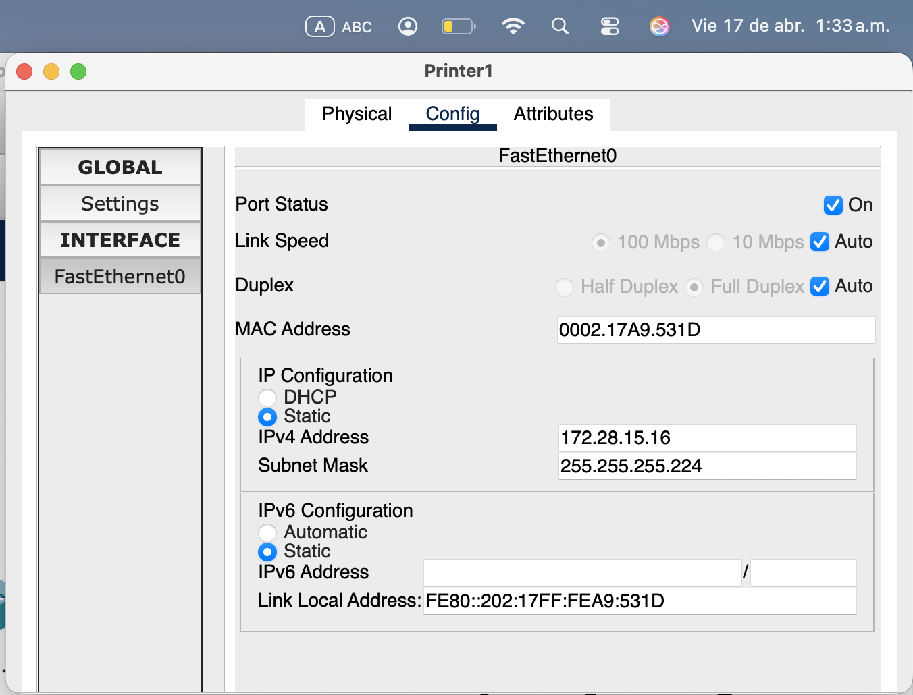
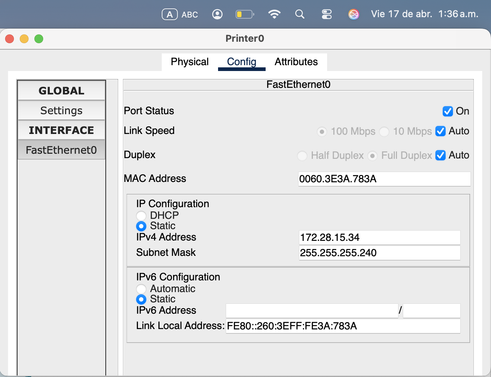

### Asignación IPs a PCs

Para la asignación de direcciones IP a las PCs, se asignan las IPs estáticas comenzando por la segunda IP útil de cada subred, quedando de la siguiente manera:


- **Área de Administración**:
    - PC0:
        - Dirección IP: 172.28.15.34/28
    - PC1:
        - Dirección IP: 172.28.15.35/28
    - PC2:
        - Dirección IP: 172.28.15.36/28

- **Área de Soporte Técnico**:
    - PC8:
        - Dirección IP: 172.28.15.2/27
    - PC9:
        - Dirección IP: 172.28.15.3/27
    - PC10:
        - Dirección IP: 172.28.15.4/27
    - PC11:
        - Dirección IP: 172.28.15.5/27
    - PC12:
        - Dirección IP: 172.28.15.6/27


- **Área de Servidores**:
    - PC20:
        - Dirección IP: 172.28.15.50/29


Esta configuración se puede realizar desde el menu de configuración de cada PC, de forma analoga a la configuración de la dirección IPv4 de cada servidor, como se muestra en las siguientes imagenes 22-24.

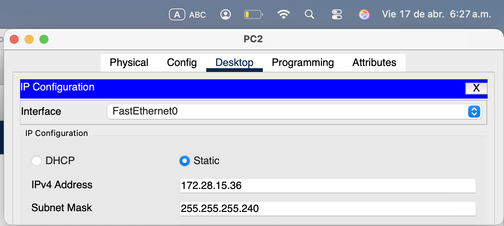
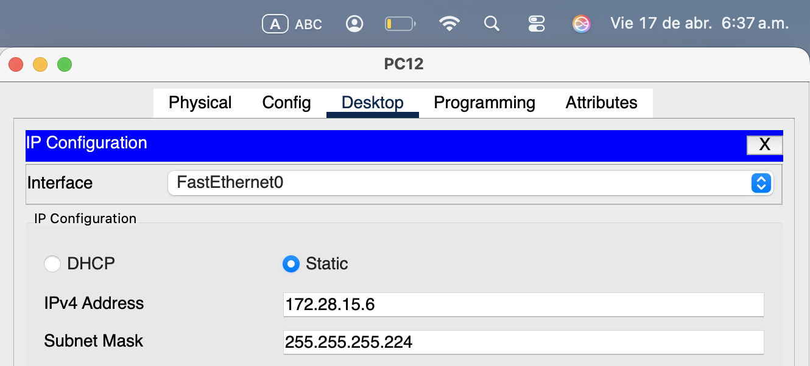
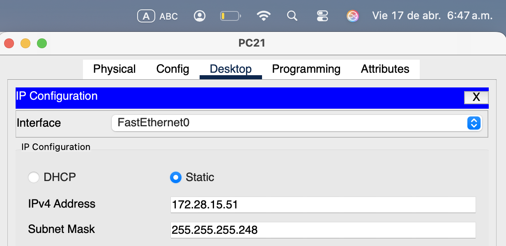

## Paso 4: Configure el gateway en los host con direccionamiento estático

Para configurar el gateway en cada host con direccionamiento estático, se asigna la dirección IP del la interfaz del router correspondiente. Para configurar esto en los PCs y servidores, vamos nuevamente al menu de configuración de cada host, seleccionamos la opción desktop y luego "IP configuration", y en el campo "Default Gateway" asignamos la dirección de la interfaz del router correspondiente a cada subred (primera IP util), quedando de la siguiente manera (img 25-27):

- **Área de Administración**:
    - Default Gateway: 172.28.15.33
- **Área de Soporte Técnico**:
    - Default Gateway: 172.28.15.1
- **Área de Servidores**:
    - Default Gateway: 172.28.15.49

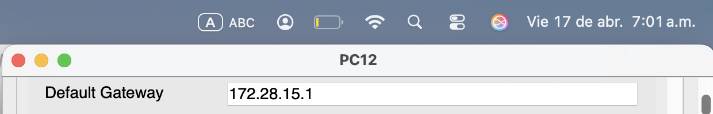
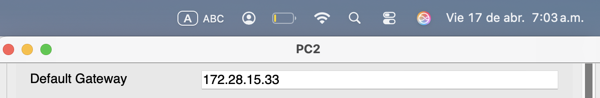
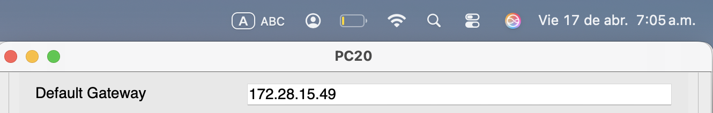

Para configurar el gateway en las impresoras, se realiza yendo al menu "Config" de cada impresora, e igualmente en el campo "Default Gateway" asignamos la dirección de la interfaz del router correspondiente a cada subred (img 28-29):

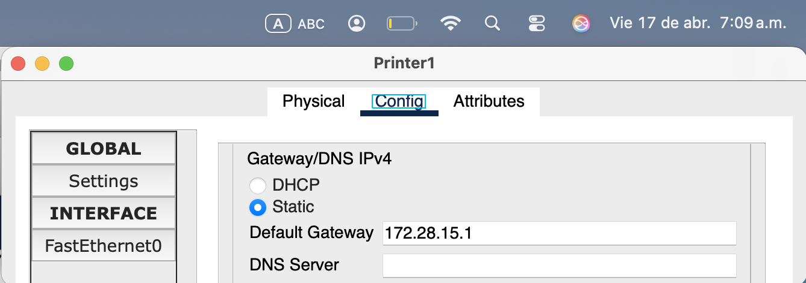
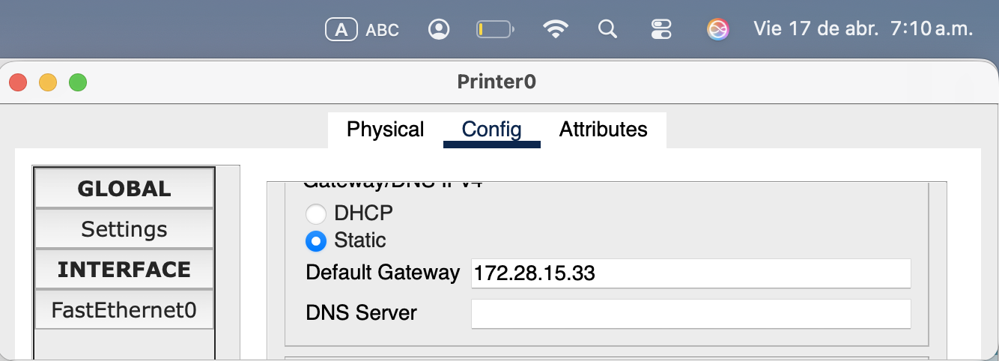

## Paso 5: Prueba de conectividad

### a Ping entre dos PCs del área de administración

Para esto seleccionamos el PC0 con dirección IP 172.28.15.34/28para realizar ping al PC2 con dirección IP 172.28.15.36/28, para esto vamos al menu "Desktop" del PC0, y seleccionamos la aplicación "Command Prompt" (Img 30),

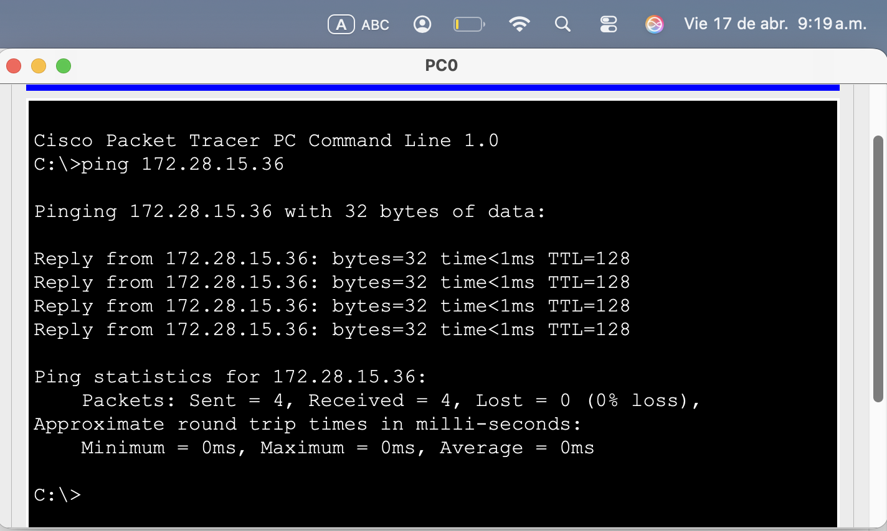

Podemos observar de la imagen 30 que el ping es exitoso.

### Ping a impresora del área de soporte técnico desde un PC del área de administración

Para esto seleccionamos el PC1 del área de administración con dirección IP 172.28.15.35/28, y realizamos ping a la impresora del área de soporte técnico con dirección IP 172.28.15.16/27, siguiendo el mismo procedimiento observamos que el ping es exitoso (img 31).

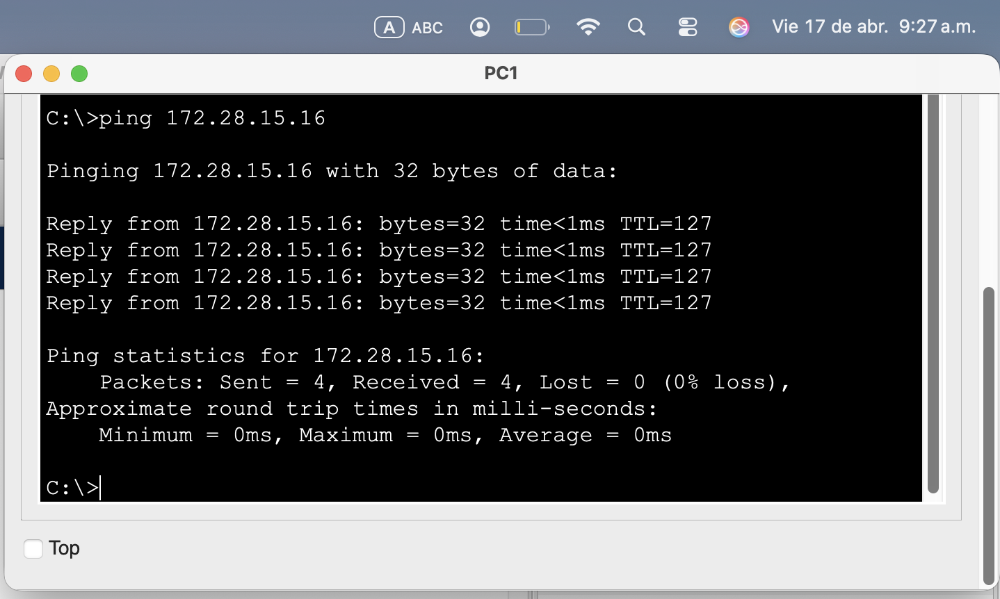

### Simulación

Activamos la simulación y configuramos los filtros de forma correspondiente (img 32-34)

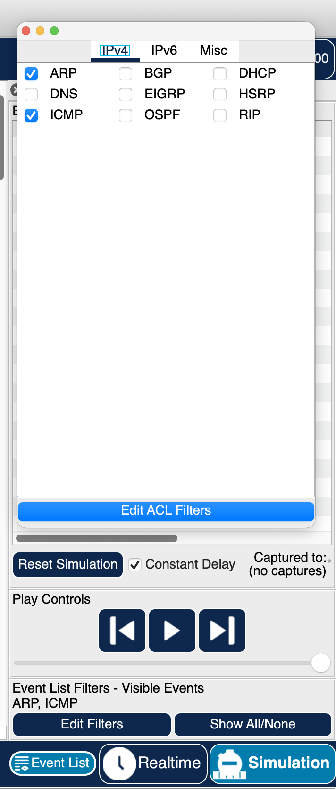
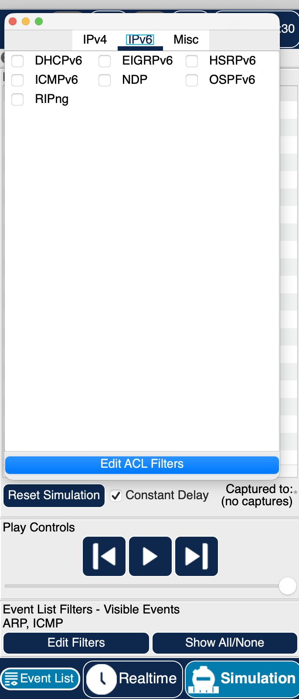
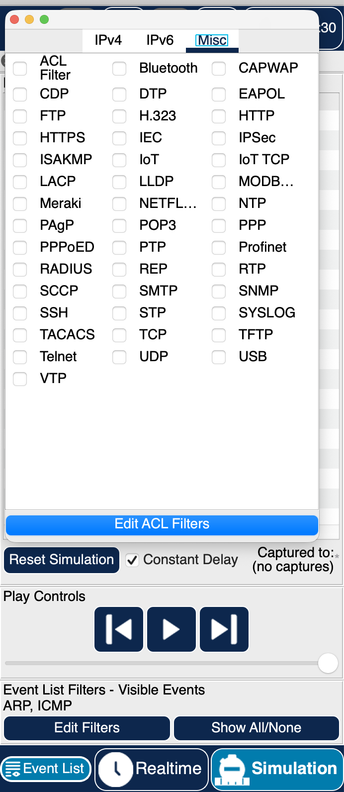

Dado que el punto 3 no se le asigno ningún IP estática a las laptos del Area de Administración, procederemos a asignarles la IP 172.28.15.44/28 y gateway 172.28.15.33
la a Laptop1:

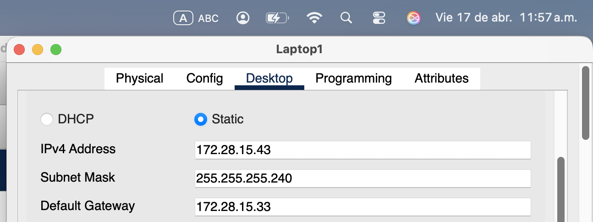

Ahora realizamos ping desde el servidor web con dirección IP 172.28.15.53/29 a la Laptop1 (img 36):

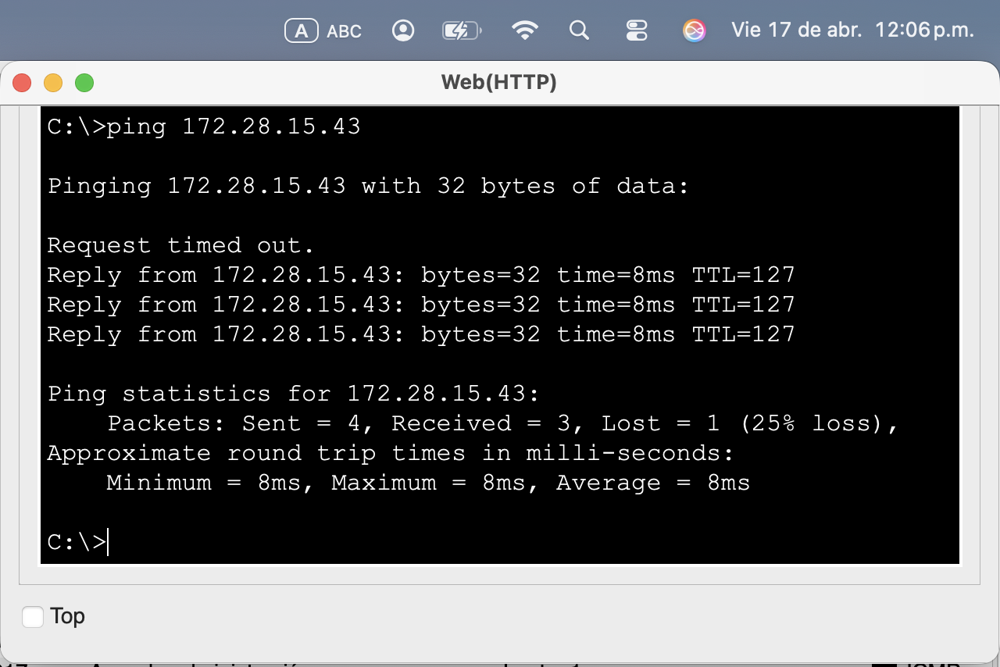

Observamos que el ping tiene una perdida de 25% debido a que cuando se realizo la primer solicitud de ping pues tanto el router como el switch y el servidor no tenían la dirección MAC de la Laptop1 en su tabla ARP.

## Paso 6: Lista de eventos y protocolos

En la lista de la imagen 37 observamos los protocolos Address Resolution Protocol (ARP) y Internet Control Message Protocol (ICMP) que se usan para la resolución de direcciones IP a direcciones MAC (ARP) y para el envío de mensajes de error e información operativa (ICMP). 

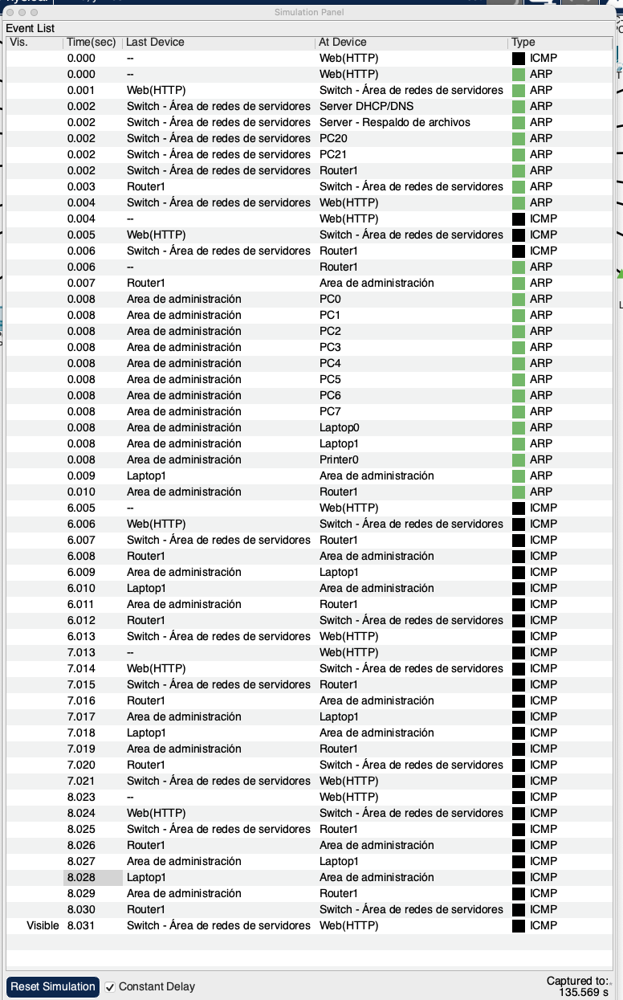

## Paso 7: ¿Por qué se necesita conocer la MAC antes de enviar ICMP?

La dirección es necesaria debido a que el protocolo ICMP es un protocolo 
de la capa de red asociado al direccionamiento lógico IP, util para la comunicación entre hosts a través de internet, y por lo tanto requiere la dirección MAC para realizar el envió de los paquetes ICMP de forma tal que llegue a un dispositivo físico concreto con dirección MAC dada.

Se puede notar en la imagen 37 que la presencias del protocolo ARP en conjunto con los paquetes ICMP del primer ping no exitoso. Esto se debe a que primera instancia el servidor web no tenia la dirección MAC de la Laptop1 en su tabla ARP, por lo que fue necesaria realizar una serie de solicitudes ARP para resolver la dirección MAC asociada a la dirección IP de la Laptop1, y una vez resuelta esta dirección MAC, el servidor web pudo enviar los paquetes ICMP a la Laptop1, lo que permitió que el ping fuera exitoso en las siguientes solicitudes.

## Paso 8: ¿Qué dispositivo reenvió la trama y por qué?

Debido a que la tramas ARP y ICMP es un PDU de capa enlace de datos(capa 2), el dispositivo encargado de reenviar estas tramas es el switch, ya que este dispositivo opera en la capa de enlace de datos y es responsable de recibir las tramas entrantes, leer la dirección MAC de destino y reenviar la trama al puerto correspondiente donde se encuentra el dispositivo con esa dirección MAC. Inicialmente el switch Area de Administración reenvía la trama recibida del servidor web al router (img 38), y el switch Area de Administración reenvía la trama recibida del router a la Laptop1 (img 39).

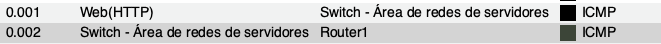
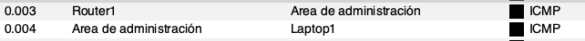

## Paso 9: ¿Qué función cumple el router?

El router tiene la función de enrutar paquetes entre diferentes redes o subredes. En este caso, el router se encarga de recibir los paquetes ICMP enviados por el servidor web desde la subred de servidores, y reenviarlos a la subred de administración donde se encuentra la Laptop1. El router utiliza su tabla de enrutamiento para determinar la mejor ruta para enviar los paquetes al destino correcto, asi como una tabla ARP para resolver las direcciones IP a direcciones MAC cuando es necesario. 

## Paso 10. ¿Qué función cumple el switch?

El switch tiene la función de recibir tramas entrantes, leer la dirección MAC de destino y reenviar la trama al puerto correspondiente donde se encuentra el dispositivo con esa dirección MAC.

## Paso 11. ¿En qué capa del modelo OSI operan?

El router opera principalmente en la capa de red (capa 3) del modelo OSI.

El switch opera principalmente en la capa de enlace de datos (capa 2) del modelo OSI, aunque algunos switches también pueden operar en la capa de red (capa 3) si tienen capacidades de enrutamiento.


