# Implementación de servicios
## Paso 1: Habilitación y configuración de DHCP

Para habilitar y configurar el servicio DHCP en un servidor en Packet Tracer, debemos:

1. Seleccionar el servidor en el que deseamos habilitar DHCP.
2. Ir a la pestaña de "Services". 
3. Seleccionar "DHCP" en la lista de servicios disponibles.
4. Configurar el servicio DHCP como se en la imagen:
    - Cambiamos el estado del servicio a "ON".
    - Configuramos la puerta de enlace predeterminada (Default Gateway) que se asignará a los clientes DHCP.
    - Configuramos el rango de direcciones IP que se asignarán a los clientes DHCP, especificando la dirección IP inicial (Start IP Address) y la mascara de subred (Subnet Mask).

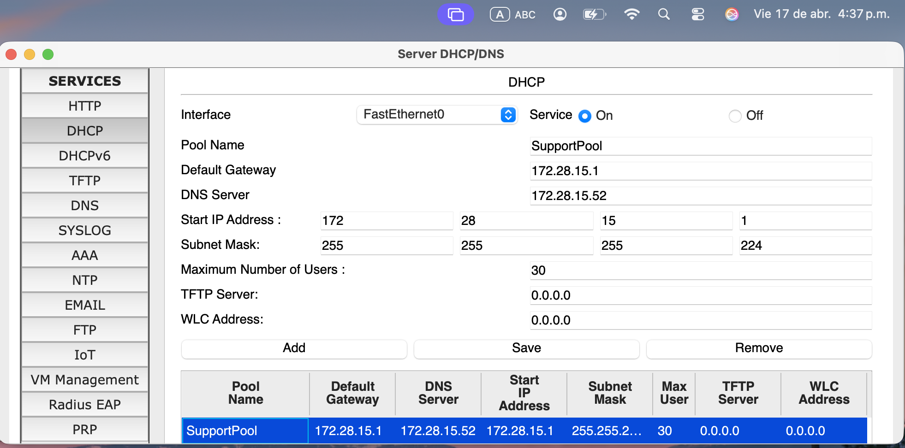
Observemos que este proceso no es suficiente pues si intentamos asignar dinámicamente una dirección IP por ejemplo a un PC13 observamos que (img 1), el PDU que llega al router desde el PC13 contiene un mensaje que indica que el router descarto el paquete. Esto lo podemos confirmar al revisar el la configuración del PC13 (img 2) y observar que no se le asigno una puerta de enlace predeterminada (Default Gateway)

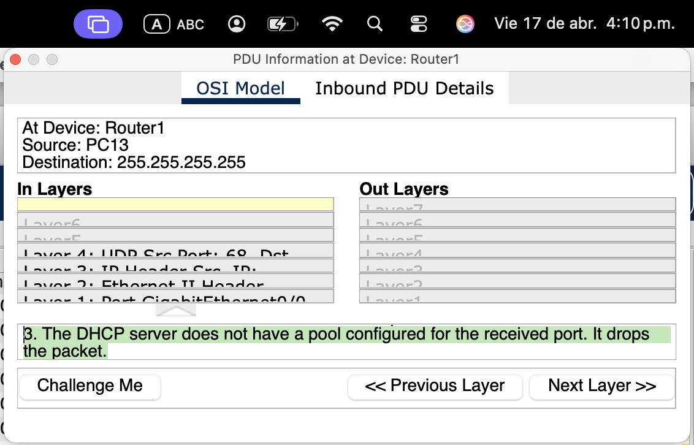
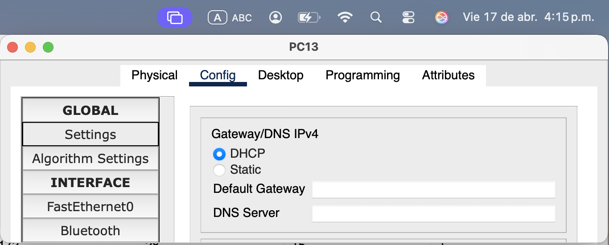

Esto ocurre porque el router no tiene configurada la dirección auxiliar(helper address) asociada a la ip del servidor DHCP. Para configurar esto, debemos ingresar al router y ejecutar el siguiente comando en modo de configuración de la interfaz que conecta con el switch Area de Soporte  (img 3):

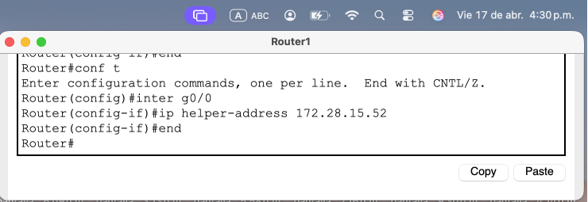

Una vez realizada esta configuración, el servidor DHCP podrá asignar direcciones IP dinámicamente a los clientes que se conecten a la red de soporte (img 4-6).

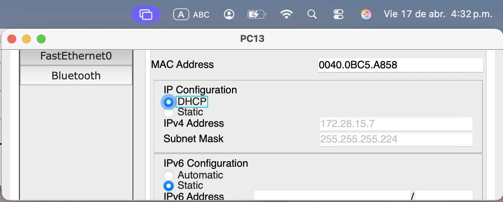
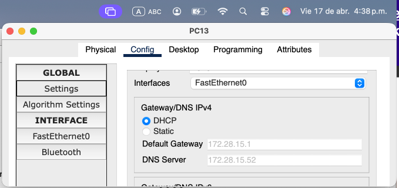
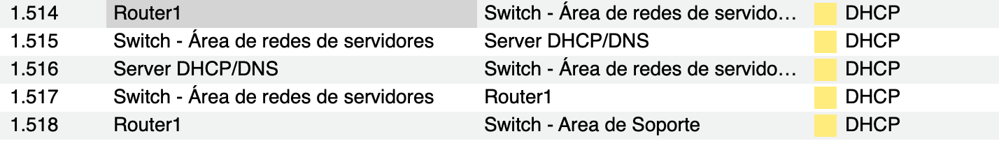

## Paso 2: Configuración DNS 

Para configurar el servicio DNS en el servidor, debemos(img 7 y 8):
1. Seleccionar el servidor en el que deseamos habilitar DNS.
2. Ir a la pestaña de "Services".
3. Seleccionar "DNS" en la lista de servicios disponibles.
4. Configurar el servicio DNS como se muestra en la imagen:
    - Cambiamos el estado del servicio a "ON".
    - Agregamos un nuevo registro DNS, especificando el nombre del host (Host Name) y la dirección IP correspondiente (IP Address).
    - Habilitar el servicio HTTP.
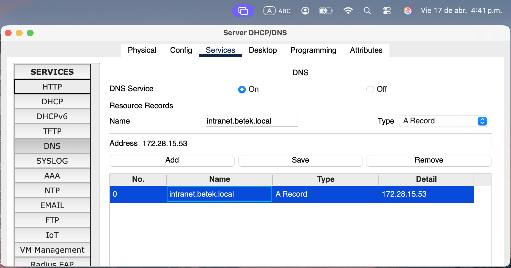

## Paso 3: Verificación servicio HTTP
Verificamos que el servicio HTTP se encuentre en estado on en el servidor web.
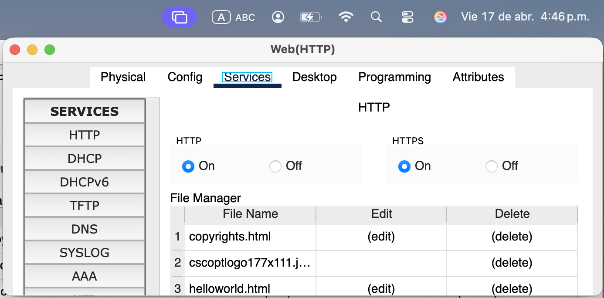

## Paso 4: Agregar pagina Workshop

Para agregar una página web personalizada al servidor web, debemos seguir los siguientes pasos:
1. Seleccionar el servidor web en Packet Tracer.
2. Ir a la pestaña de "Services".
3. Seleccionar "HTTP" en la lista de servicios disponibles.
4. En la sección de "HTTP", hacer clic en "new file" para crear una nueva página web.
5. Escribir el contenido HTML de la página web personalizada en el editor de texto que se abre (img 9).

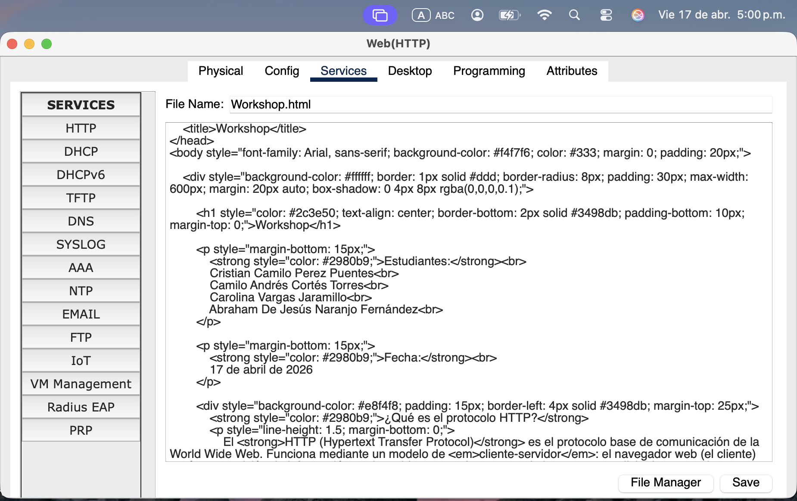

## Paso 5: Enlace a pagina Workshop.html en Index.html

Para enlazar la página "Workshop.html" en la página "Index.html", debemos editar el archivo "Index.html" y agregar un enlace HTML que apunte a "Workshop.html". El código HTML para crear un enlace es el siguiente:

```html
<a href="Workshop.html">Workshop</a>
```

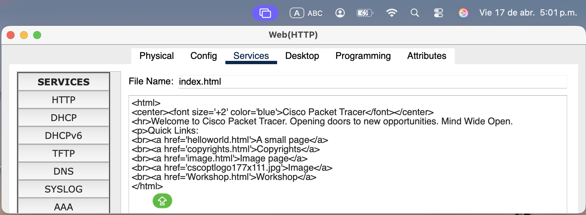

Podemos ahora acceder a la pagina desde por ejemplo el PC13 en la red de soporte (img 11).

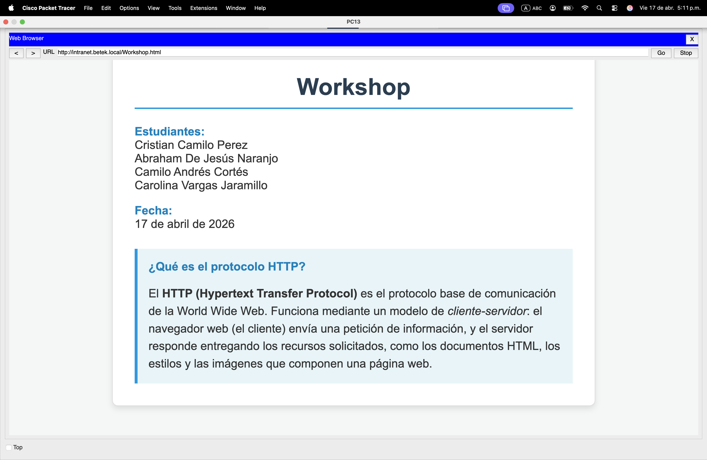

## Paso 6: Simulación DNS

Configuramos los filtros de la simulación para habilitar unicamente la captura de paquetes DNS (img 12).

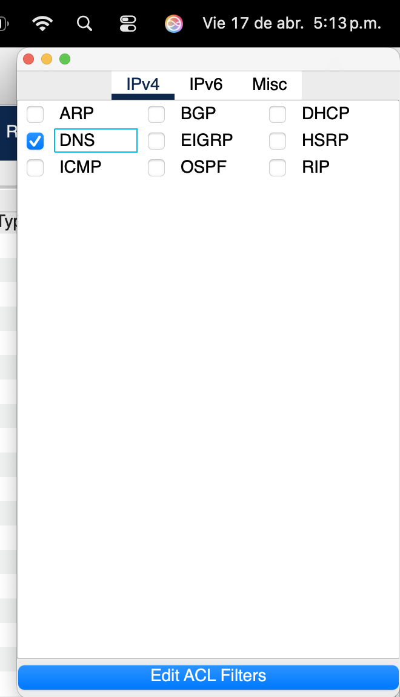

Y iniciamos la simulación para observar el proceso de resolución de nombres DNS.

## Paso 7:Agregar DNS en PC9 de la red de soporte

Para configurar el DNS en el PC9 de la red de soporte, debemos seguir los siguientes pasos:
1. Seleccionar el PC8 en Packet Tracer.
2. Ir a la pestaña de "Desktop".
3. Hacer clic en "IP Configuration".
4. En la sección de "DNS Server", ingresar la dirección IP del servidor DNS que configuramos la cual es 172.28.15.53 (img 13).

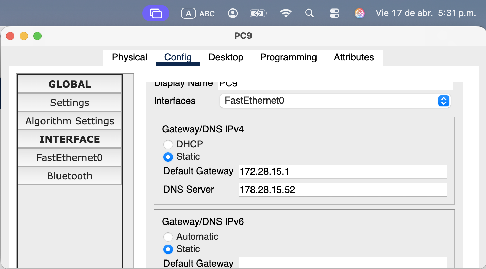

## Paso 8: Navegación a intranet.betek.local en PC9

Para navegar a la página "intranet.betek.local" desde el PC9, debemos abrir un navegador web en el PC9 ingresando al desktop (img 14)

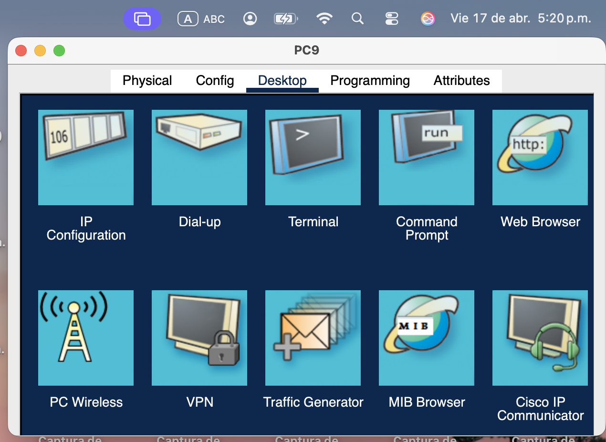

Luego, ingresamos la dirección "http://intranet.betek.local"(img 15).

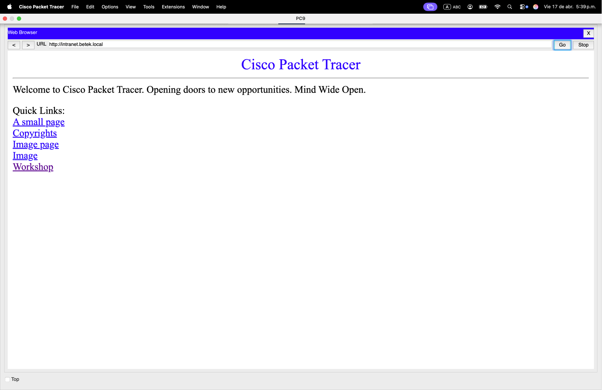

## Paso 9:Visualización simulación DNS

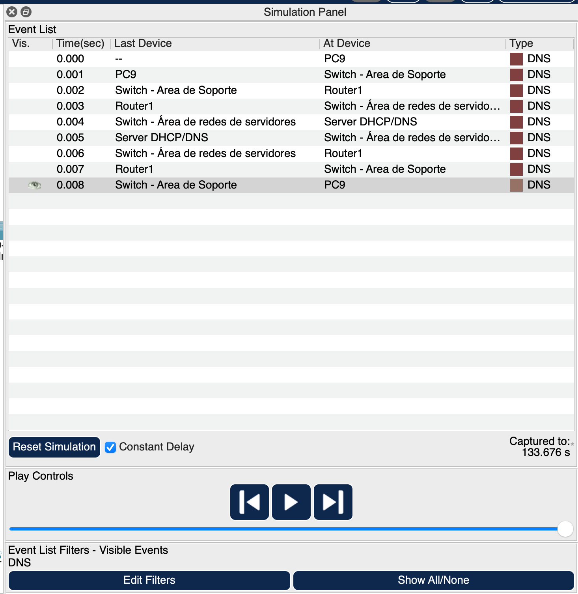

## Paso 10: Navegación a Workshop.html desde PC9

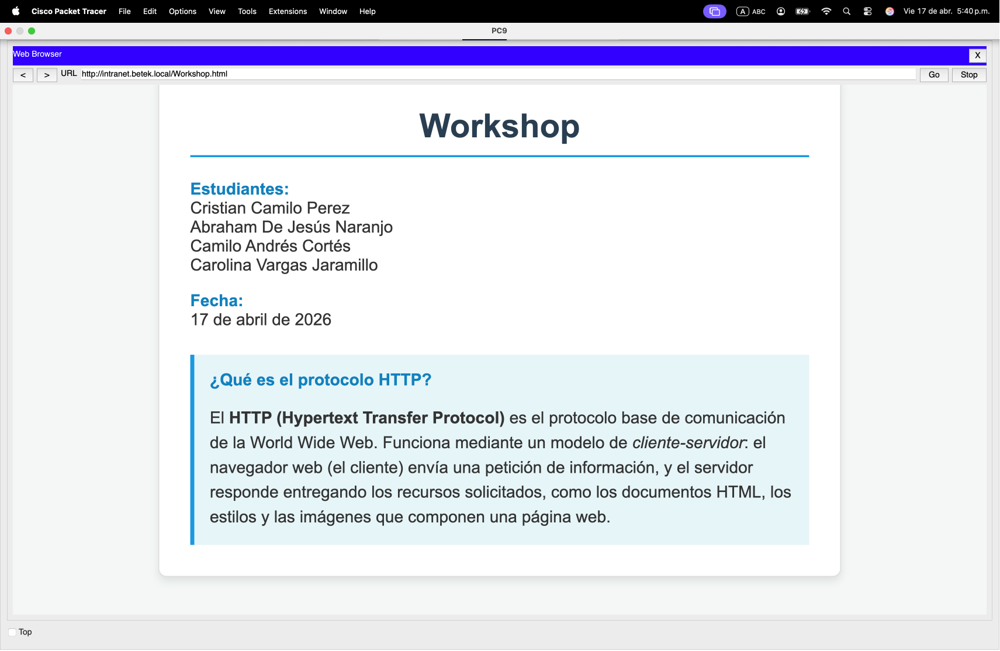

## Paso 11:  ¿Por qué abrir un sitio web implica más pasos que hacer ping?

Esto es debido a que en el peor de los casos, para realizar una consulta DNS, el cliente debe contactar a varios servidores DNS para resolver el nombre de dominio en una dirección IP. Esto implica múltiples pasos, como la consulta al servidor DNS raíz, luego al servidor DNS autoritativo para el dominio específico, y finalmente la obtención de la dirección IP correspondiente. En contraste, hacer ping a una dirección IP es un proceso directo que no requiere resolución de nombres, lo que lo hace más rápido y sencillo.

## Paso 12: 12. ¿Qué riesgos de seguridad podría tener la distribución de las subredes?