# Fase 4: Diagnóstico desde el sistema operativo

## Punto 1: Diagnóstico en Packet Tracer

### Dispositivos seleccionados
- **Administración:** PC0 - IP: 172.28.15.34
- **Soporte Técnico:** PC8 - IP: 172.28.15.2
- **Servidores:** PC20 - IP: 172.28.15.50

---

## PC0 - Área de Administración

### a) ipconfig
El comando `ipconfig` muestra la configuración de red del dispositivo.

**Resultado obtenido en PC0:**

- **IPv4 Address:** 172.28.15.34
- **Subnet Mask:** 255.255.255.240
- **Default Gateway:** 172.28.15.33

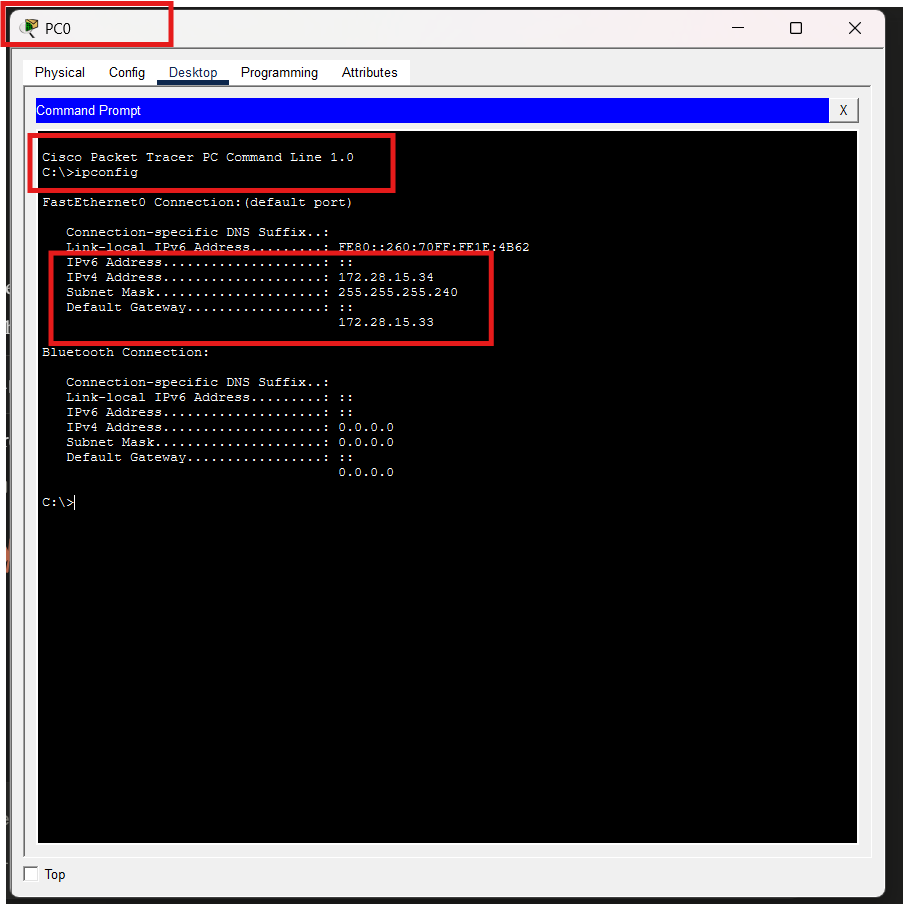

### b) Ping al Gateway

**Resultado obtenido en PC0:**

- **Gateway:** 172.28.15.33
- **Paquetes enviados:** 4
- **Paquetes recibidos:** 4
- **Pérdida:** 0%

El ping fue exitoso, confirmando que el PC0 tiene 
conectividad con el gateway de la red de Administración.

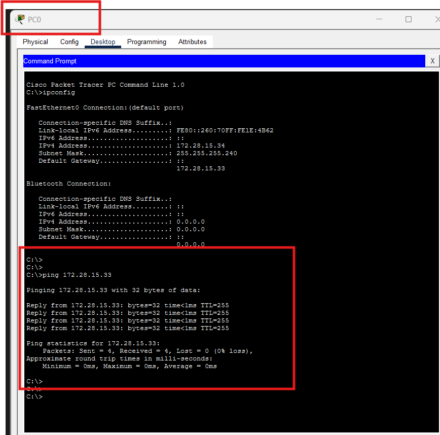

### c) nslookup intranet.betek.local

El comando `nslookup` permite consultar el servidor DNS 
para resolver un nombre de dominio a una dirección IP.

**Resultado obtenido en PC0:**

- **Servidor DNS:** 172.28.15.52
- **Nombre consultado:** intranet.betek.local
- **IP resuelta:** 172.28.15.53

**¿Para qué sirve nslookup?**
El comando `nslookup` sirve para consultar servidores DNS 
y verificar que un nombre de dominio se resuelve 
correctamente a su dirección IP. Es muy útil para 
diagnosticar problemas de resolución de nombres en la red.

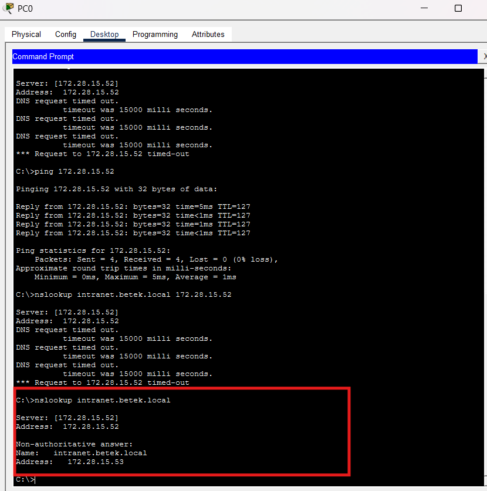

### d) Tabla ARP (arp -a)

El comando `arp -a` muestra las asociaciones IP-MAC 
conocidas por el dispositivo.

**Resultado obtenido en PC0:**

| Dirección IP | Dirección MAC | Tipo |
|---|---|---|
| 172.28.15.33 | 000a.418d.ac02 | dynamic |

La única entrada en la tabla ARP es el gateway 
(172.28.15.33), lo que indica que el PC0 ha 
comunicado recientemente con él.

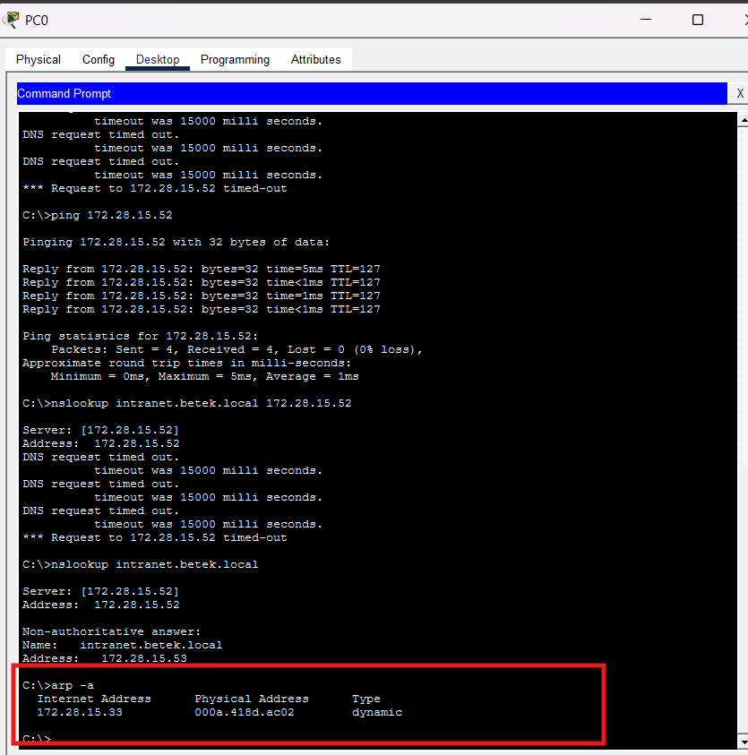

---
## PC8 - Área de Soporte Técnico

### a) ipconfig
El comando `ipconfig` muestra la configuración de red del dispositivo.

**Resultado obtenido en PC8:**
- **IPv4 Address:** 172.28.15.2
- **Subnet Mask:** 255.255.255.224
- **Default Gateway:** 172.28.15.1

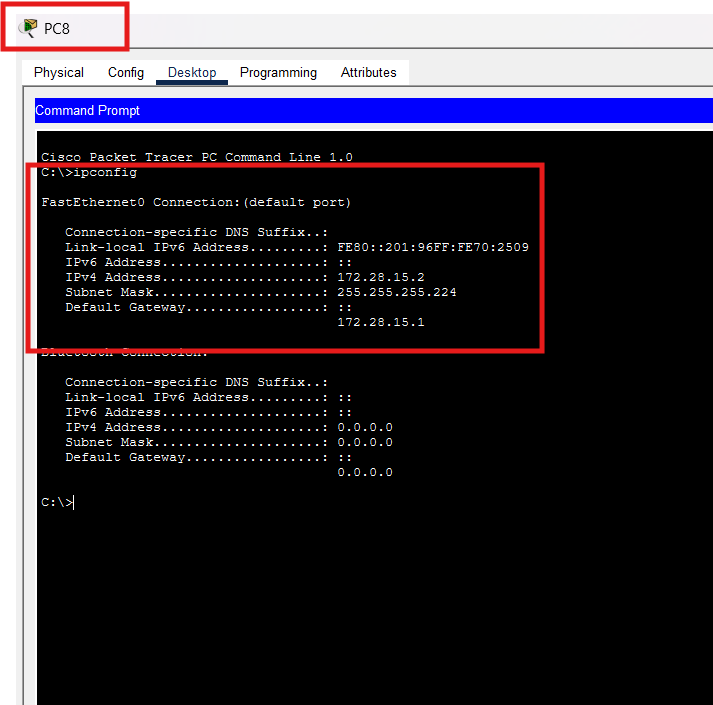

### b) Ping al Gateway
**Resultado obtenido en PC8:**
- **Gateway:** 172.28.15.1
- **Paquetes enviados:** 4
- **Paquetes recibidos:** 4
- **Pérdida:** 0%

El ping fue exitoso, confirmando que el PC8 tiene 
conectividad con el gateway de la red de Soporte Técnico.

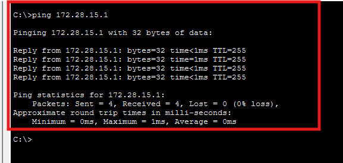

### c) nslookup intranet.betek.local
**Resultado obtenido en PC8:**
- **Servidor DNS:** 172.28.15.52
- **Nombre consultado:** intranet.betek.local
- **IP resuelta:** 172.28.15.53

El nslookup resolvió correctamente el nombre de dominio.

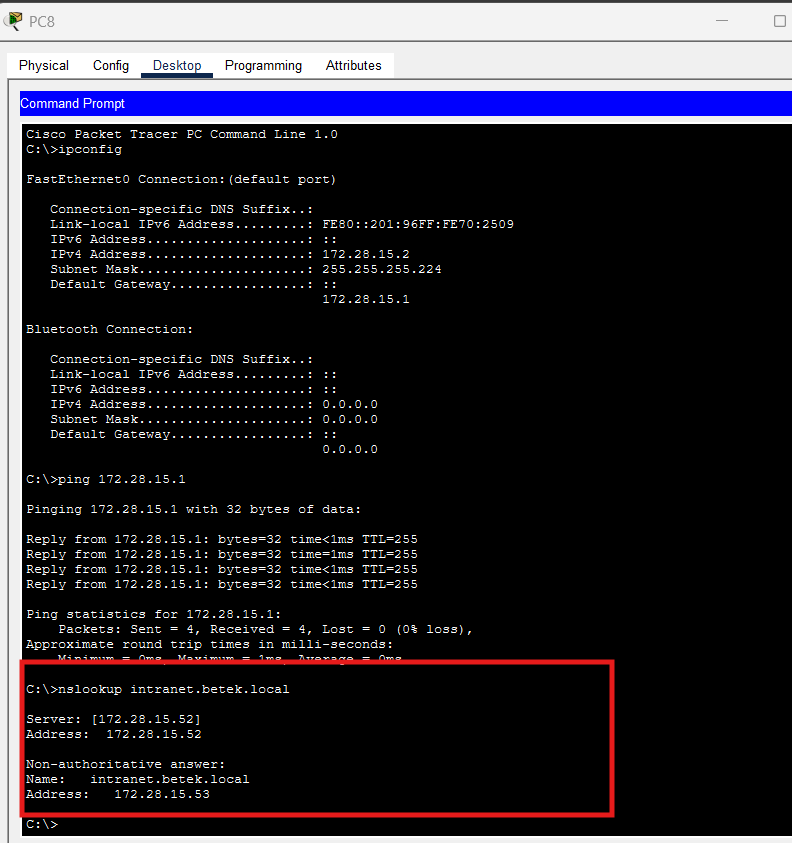

### d) Tabla ARP (arp -a)
**Resultado obtenido en PC8:**

| Dirección IP | Dirección MAC | Tipo |
|---|---|---|
| 172.28.15.1 | 000a.418d.ac01 | dynamic |

La tabla ARP muestra el gateway como único dispositivo 
conocido por el PC8.

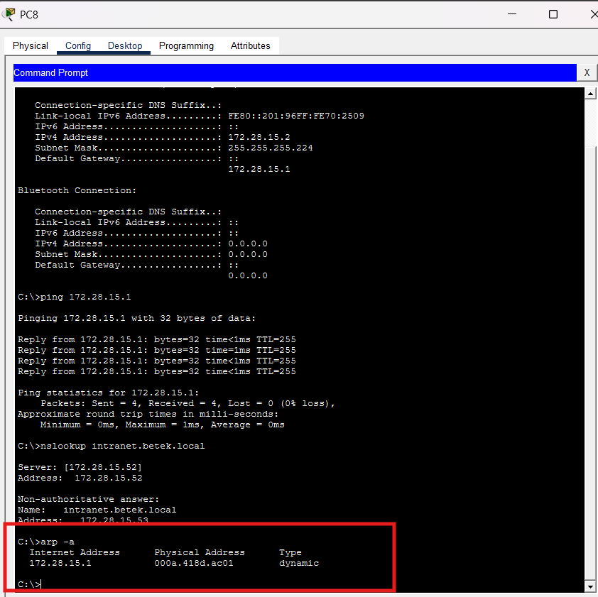

## PC20 - Área de Servidores

### a) ipconfig

**Resultado obtenido en PC20:**

- **IPv4 Address:** 172.28.15.50
- **Subnet Mask:** 255.255.255.248
- **Default Gateway:** 172.28.15.49

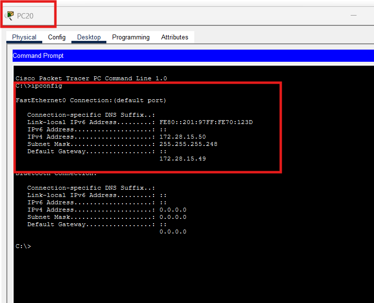
### b) Ping al Gateway

**Resultado obtenido en PC20:**

- **Gateway:** 172.28.15.49
- **Paquetes enviados:** 4
- **Paquetes recibidos:** 4
- **Pérdida:** 0%

El ping fue exitoso, confirmando que el PC20 tiene 
conectividad con el gateway de la red de Servidores.

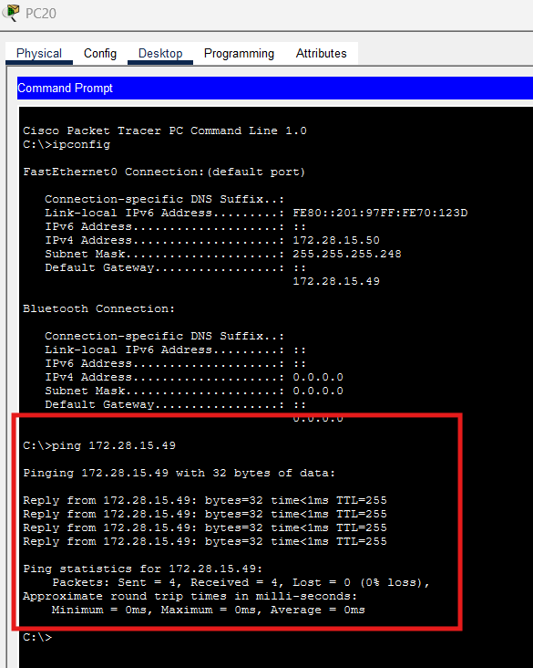
### c) nslookup intranet.betek.local

**Resultado obtenido en PC20:**

- **Servidor DNS:** 172.28.15.52
- **Nombre consultado:** intranet.betek.local
- **IP resuelta:** 172.28.15.53

El nslookup resolvió correctamente el nombre de dominio 
desde la red de Servidores.

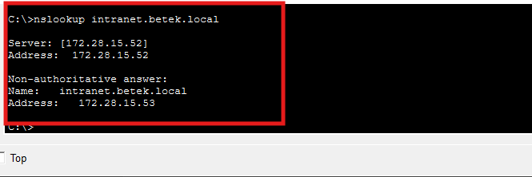

### d) Tabla ARP (arp -a)

**Resultado obtenido en PC20:**

| Dirección IP | Dirección MAC | Tipo |
|---|---|---|
| 172.28.15.49 | 000a.418d.ac03 | dynamic |
| 172.28.15.52 | 00d0.970e.c64b | dynamic |

La tabla ARP muestra el gateway (172.28.15.49) y el 
servidor DNS (172.28.15.52), dispositivos con los que 
el PC20 ha comunicado recientemente.

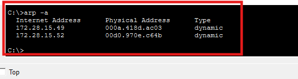

## Punto 2: Diagnóstico en el sistema operativo real

### Comando: netstat -ano

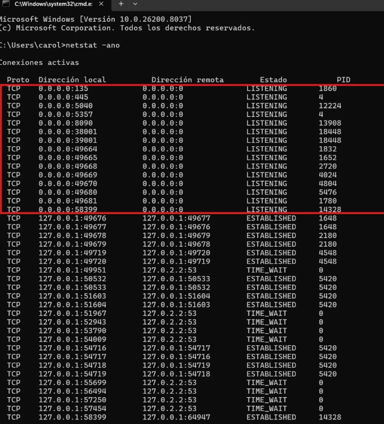
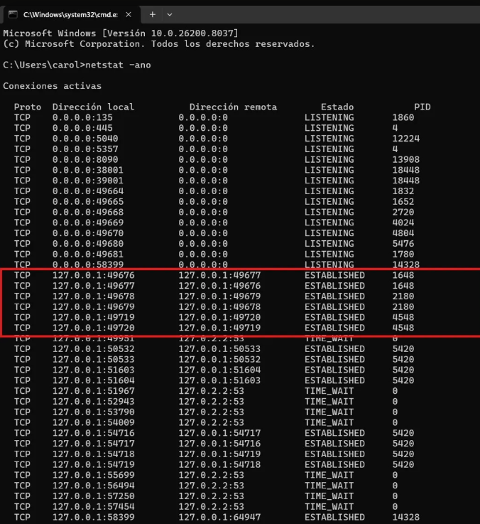
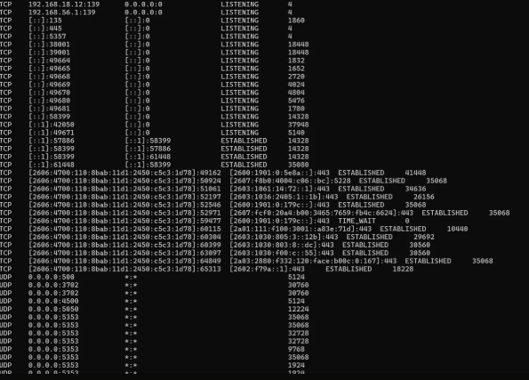
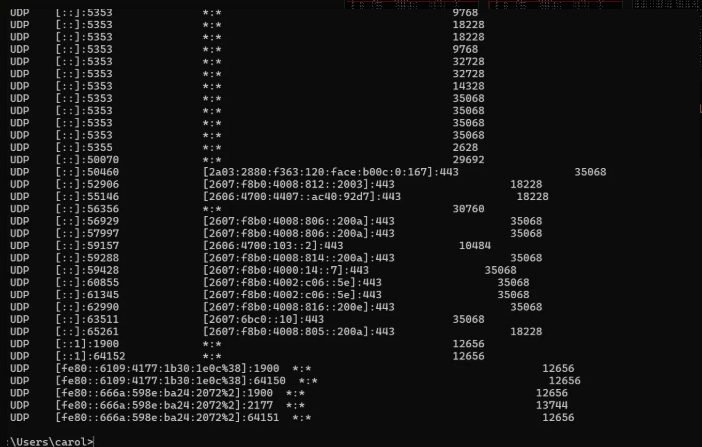

### a) ¿Para qué sirve netstat?
`netstat -ano` muestra todas las conexiones de red 
activas, los puertos en escucha y el PID del proceso 
asociado a cada conexión.

### b) ¿Qué significa que un puerto esté en estado Listening?
Significa que el puerto está abierto esperando 
conexiones entrantes. El proceso asociado está listo 
para aceptar comunicaciones en ese puerto.

### c) ¿Por qué los servicios UDP no muestran estado Established?
Porque UDP es un protocolo sin conexión, no establece 
una sesión formal entre emisor y receptor. Por eso no 
tiene estados como ESTABLISHED o LISTENING.

### d) Tabla de conexiones

| Protocolo | Dirección local | Dirección remota | Estado | PID | Nombre del proceso |
|---|---|---|---|---|---|
| TCP | 0.0.0.0:135 | 0.0.0.0:0 | LISTENING | 1860 | svchost.exe |
| TCP | 0.0.0.0:445 | 0.0.0.0:0 | LISTENING | 4 | System |
| TCP | 127.0.0.1:49676 | 127.0.0.1:49677 | ESTABLISHED | 1648 | WUDFHost.exe |
| UDP | 0.0.0.0:5353 | *:* | - | 35068 | chrome.exe |
| UDP | 0.0.0.0:5050 | *:* | - | 12224 | svchost.exe |
| UDP | [::1]:1900 | *:* | - | 12656 | svchost.exe |

**Verificación de procesos con tasklist:**

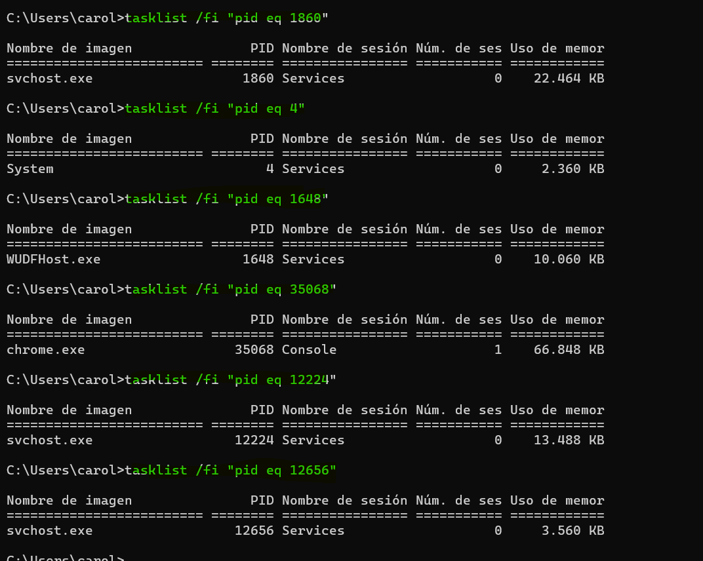