BOOTCAMP CIBERSEGURIDAD 2026

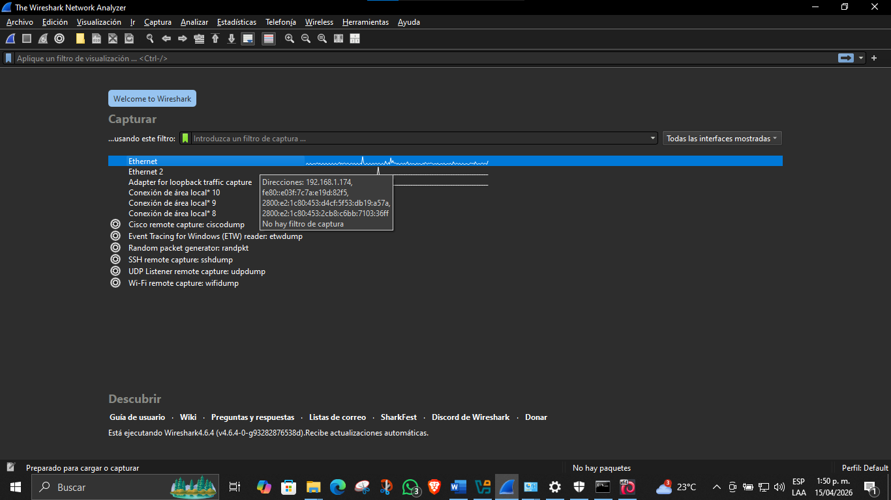

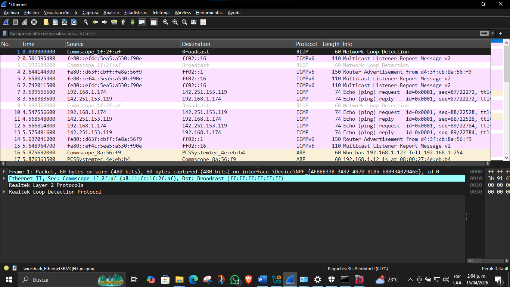

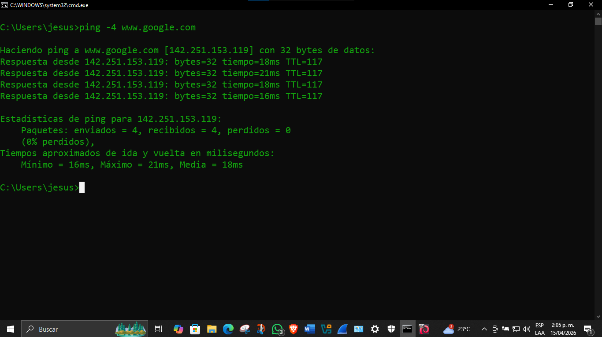

WORKSHOP DE REDES Y WIRESHARK

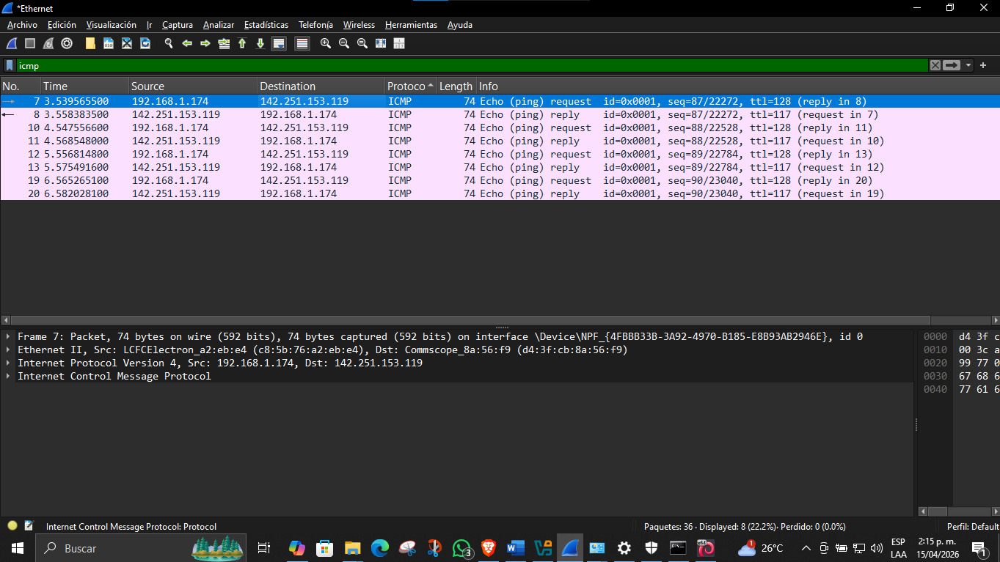

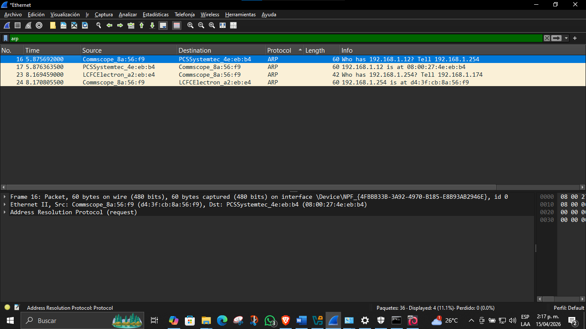

PUNTO 5

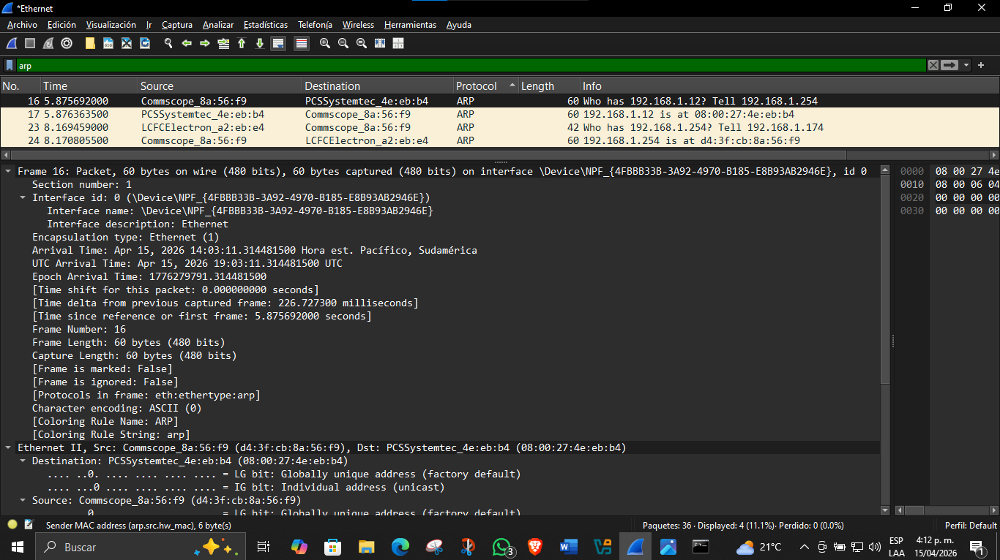

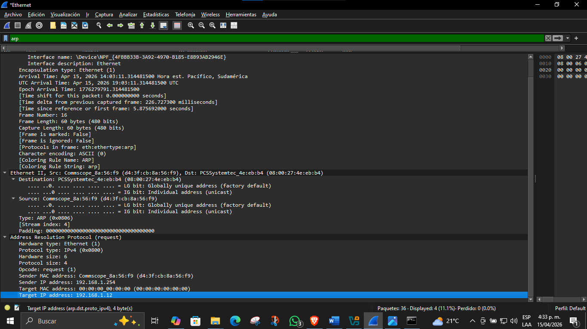

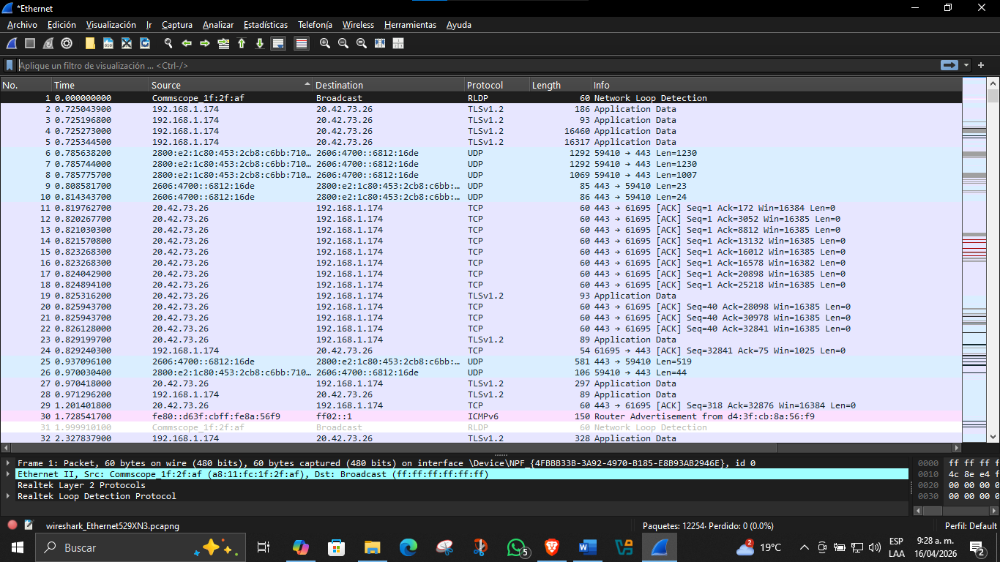

Elaborado Por:

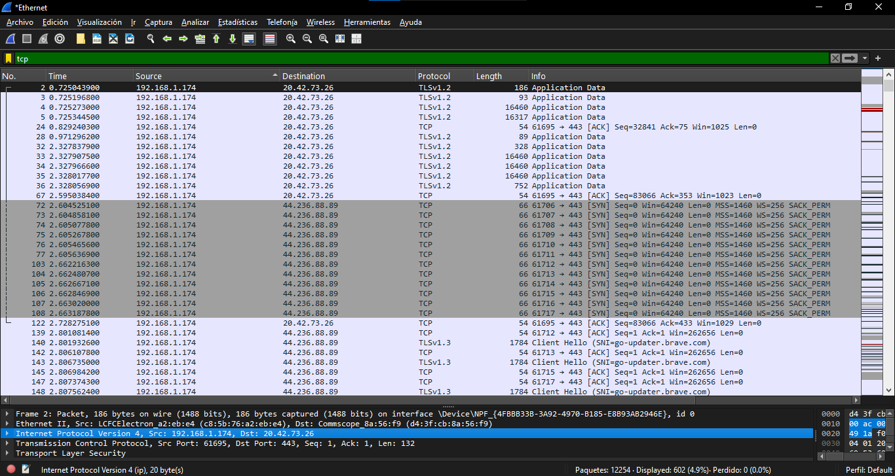

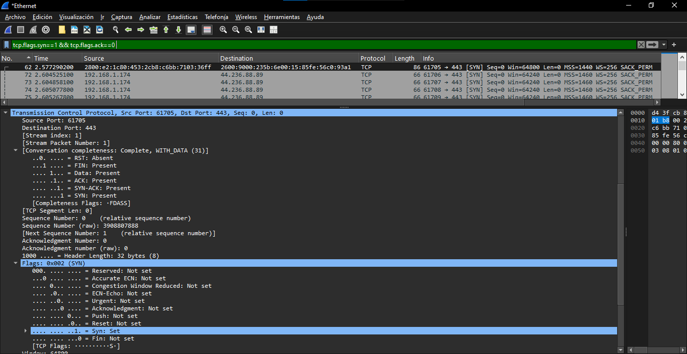

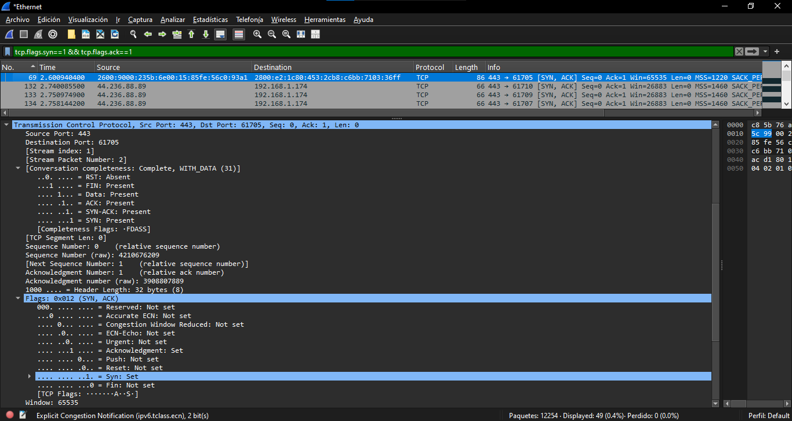

Abraham De Jesús Naranjo Fernández

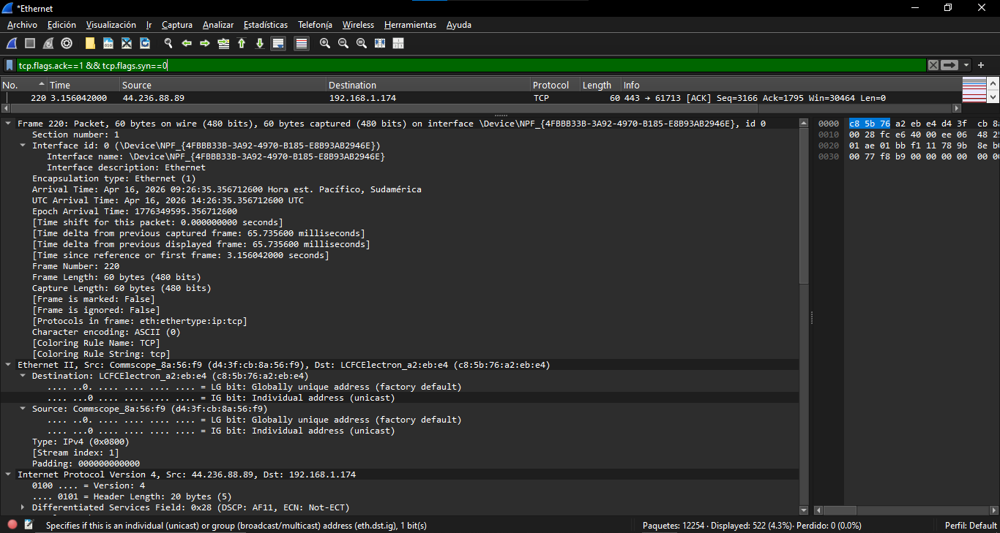

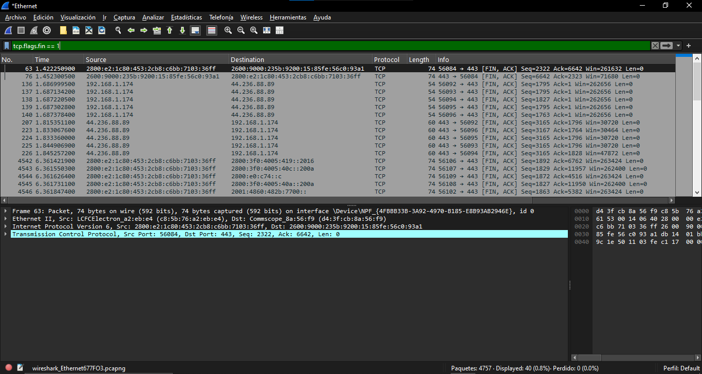

Fase 5. Captura y análisis con Wireshark

En esta fase deberá generar tráfico de manera controlada y luego inspeccionarlo en Wireshark. La idea es que no solo vea paquetes, sino que reconstruya lo que ocurrió en una sesión de comunicación.

1. Seleccione un sitio Web de su preferencia y documente la URL.

URL: www.google.com

2.  Abra Wireshark y seleccione la interfaz de red correcta y a continuación inicie la captura de tráfico.

3. Desde la terminal en Kali Linux o desde el CMD de Windows realice un ping al sitio web elegido.

Acá me toco usar el comando: ping -4 para forzar al envío de paquetes icmp y no como se envían en su defecto en el caso de mi red por icmpv6.

4. Observe en Wireshark el tráfico ICMP y ARP y documente lo siguiente:

A. Ping Echo Request

IP origen: 192.168.1.174 (PC de Abraham)

IP destino: 142.251.153.119 (www.google.com)

Tipo De ICMP: 8 (Echo Request)

Explicación: Solicitud enviada para comprobar la conectividad

B. Ping Echo reply

IP destino: 142.251.153.119 (www.google.com)

IP origen: 192.168.1.174 (PC de Abraham)

Tipo De ICMP: 0 (Echo Reply)

Explicación: Respuesta que confirma que el host está activo

C. Solicitud ARP (ARP Request)

D. Respuesta ARP (ARP Reply)

[ARP Request]   →   [ARP Reply]   →   [ICMP Echo Request]   →   [ICMP Echo Reply]

Explicación del flujo

ARP Request: PC de Abraham pregunta quién tiene la IP del gateway o del destino.

ARP Reply: El dispositivo responde con su dirección MAC.

ICMP Echo Request: Una vez resuelta la MAC, el PC de Abraham envía el ping al servidor (Google).

ICMP Echo Reply: El servidor responde confirmando la conectividad.

Conclusiones del Punto 4: ICMP y ARP

El análisis realizado en Wireshark evidencia cómo ARP e ICMP trabajan de manera conjunta para garantizar la conectividad en la red. Primero, el protocolo ARP permite que el equipo local resuelva la dirección física (MAC) del gateway o del dispositivo destino, asegurando que los paquetes puedan ser entregados correctamente en la capa de enlace. Una vez obtenida esta información, el protocolo ICMP se utiliza para verificar la comunicación mediante el envío de mensajes Echo Request y la recepción de Echo Reply. En conjunto, estos protocolos demuestran el proceso fundamental de comunicación: ARP habilita la entrega física de los paquetes y ICMP confirma la disponibilidad lógica del destino, asegurando que la red funciona de manera correcta y confiable.

Conclusión del análisis ARP

El intercambio ARP mostrado en Wireshark evidencia el proceso de resolución de direcciones dentro de la red local. Primero, un dispositivo envía una solicitud ARP para preguntar quién tiene una IP específica; luego, el dispositivo que posee esa IP responde con su dirección MAC. Este mecanismo es esencial para que los equipos puedan comunicarse correctamente en la capa de enlace del modelo OSI antes de enviar tráfico IP o ICMP.

5. Abra el navegador y diríjase al sitio Web elegido, luego en Wireshark filtre por el protocolo tcp.

Sitio Web: www.google.com

6. Realice un análisis del saludo de 3 vías (3-way handshake) y localice el inicio de la conexión TCP y encuentre los 3 paquetes del establecimiento de sesión.

📌 Filtro en Wireshark para el 3-way handshake

El saludo de 3 vías se compone de tres paquetes:

SYN → el cliente inicia la conexión.

SYN-ACK → el servidor responde aceptando.

ACK → el cliente confirma y la conexión queda establecida.

👉 El filtro que debes usar en Wireshark es:

Código

tcp.flags.syn==1 && tcp.flags.ack==0

(para ver el primer SYN)

1. SYN → el cliente inicia la conexión.

Código

tcp.flags.syn==1 && tcp.flags.ack==1

(para ver el SYN-ACK)

2. SYN-ACK → el servidor responde aceptando.

Código

tcp.flags.ack==1 && tcp.flags.syn==0

(para ver el ACK final)

3. ACK → el cliente confirma y la conexión queda establecida.

7. Para cada paquete indique:

A. Para cada paquete indique: IP origen y destino.

B. Puerto origen y destino.

C. Bandera TCP activa.

D. Número de secuencia.

E. Número de acuse de recibo.

F.  Longitud del segmento.

Interpretación

Equipo que inicia la conexión: El cliente (PC de Abraham).

Significado del SYN-ACK: El servidor confirma que recibió la solicitud y está listo para establecer la sesión.

Resultado: La conexión TCP queda establecida y se puede iniciar el intercambio de datos (HTTPS con Google).

8. ¿Qué equipo inicia la conexión?

El equipo que inicia la conexión es el cliente, en este caso el PC de Abraham (192.168.1.174). Esto se evidencia porque el primer paquete del saludo de 3 vías es un SYN enviado desde la máquina hacia el servidor de Google (142.251.153.119, puerto 443).

9. ¿Qué significa que el servidor responda con SYN-ACK?

Cuando el servidor responde con un SYN-ACK, significa que:

Ha recibido correctamente la solicitud de conexión del cliente.

Está dispuesto a establecer la sesión TCP.

Envía su propio número de secuencia (SYN) y al mismo tiempo confirma el número de secuencia del cliente (ACK).

👉 En otras palabras, el SYN-ACK es la confirmación del servidor de que la conexión puede establecerse de manera confiable, sincronizando ambos extremos antes de transmitir datos.

10. Ahora identifique el cierre de la sesión buscando los paquetes adecuados de cierre, para ello, utilice el filtro tcp.flags.fin == 1

11. ¿Quién inició el cierre de la sesión?

El cierre de la sesión lo inicia normalmente el cliente (PC de Abraham), enviando el primer paquete con la bandera FIN hacia el servidor de Google. Esto indica que el cliente ya no tiene más datos que enviar y solicita terminar la conexión.

12. ¿Se cerró de manera ordenada?

Sí, la sesión se cerró de manera ordenada. Se observa el intercambio de paquetes FIN → ACK → FIN → ACK, lo que corresponde al procedimiento estándar de cierre TCP. Este proceso asegura que ambos extremos confirmen la finalización antes de liberar los recursos.

13. ¿Cuántos paquetes participaron en el cierre?

En un cierre TCP ordenado participan 4 paquetes:

Cliente envía FIN.

Servidor responde con ACK.

Servidor envía su propio FIN.

Cliente responde con ACK final.

14. ¿Hubo FIN/ACK o RST? Si fue RST, explique qué significa.

En este caso se observó un cierre con FIN/ACK, lo que indica un cierre limpio y controlado. Si en lugar de FIN/ACK se hubiera visto un RST (Reset), significaría que la conexión se cerró de manera abrupta, sin completar el proceso de finalización. Esto ocurre, por ejemplo, cuando una aplicación termina inesperadamente o cuando se rechaza una conexión.

Conclusión del cierre TCP: “El cierre de sesión observado en Wireshark muestra un proceso ordenado mediante el intercambio de paquetes FIN y ACK, garantizando que ambos extremos liberen la conexión de forma segura. Este mecanismo evita pérdidas de datos y asegura la correcta finalización de la comunicación.”

Interpretación de los puntos

11. ¿Quién inició el cierre de la sesión? El cierre lo inició el cliente (PC de Abraham) enviando el primer paquete con la bandera FIN.

12. ¿Se cerró de manera ordenada? Sí, se cerró de manera ordenada mediante el intercambio de FIN → ACK → FIN → ACK, que es el procedimiento estándar de cierre TCP.

13. ¿Cuántos paquetes participaron en el cierre? Participaron 4 paquetes en total.

14. ¿Hubo FIN/ACK o RST? Si fue RST, explique qué significa. Hubo FIN/ACK, lo que indica un cierre limpio y controlado. Si hubiera sido RST, significaría que la conexión se cerró abruptamente, sin completar el proceso de finalización, lo cual ocurre en casos de error o interrupción inesperada.